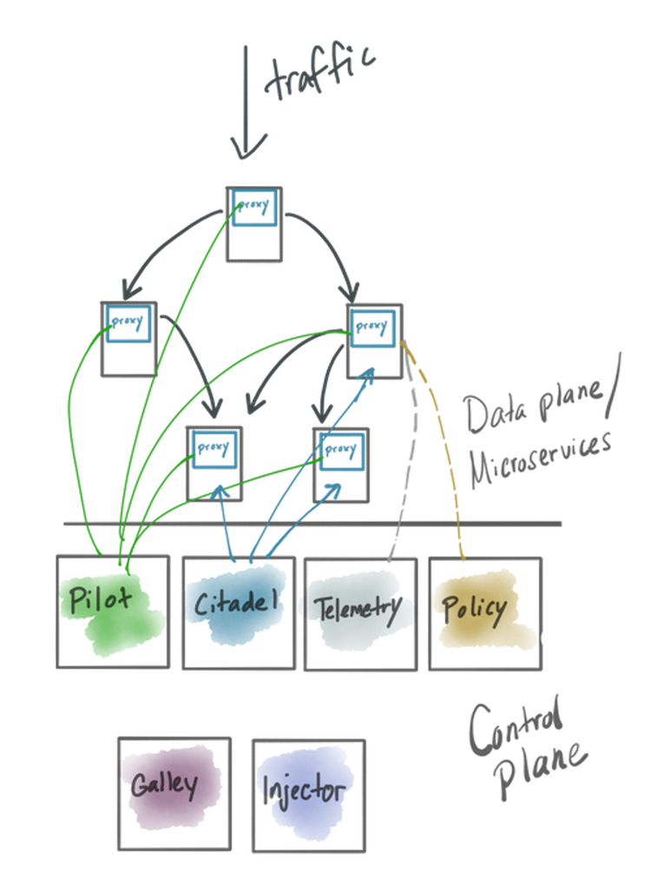

# 1. Intro

# 1.1 What is Service Mesh
Ref: https://istio.io/docs/concepts/what-is-istio/#what-is-a-service-mesh


__Istio Service Mesh__ is a network connectivity (i.e. __mesh__) within Kubernetes cluster created by __Envoy proxy__ containers, be it a standalone or a sidecar proxy:


Another huge benefit of Istio is the default in-cluster __mutual TLS__.

Without istio, say if using __Ingress controller__, you can configure __TLS termnation__ at ingress controller pod, like this:


With __istio__, __connections among pods__ in the cluster behind the what-used-to-be ingress controller (i.e. Istio Gateway) can be __mutual TLS__, without changing app code:


# 1.2 Istio Service Mesh Architecture
Ref: https://istio.io/latest/docs/ops/deployment/architecture/


Brief Architectural Summary of Istio:


- service-mesh implementations comes with a __control plane__(istiod) and a __data plane__(a standalone edge Envoy proxy and sidecar Envoy proxies)
- __data plane__ is composed of a set of intelligent proxies (__Envoy__) deployed as sidecars.  These proxies mediate and control all network communication between microservices. They also collect and report telemetry on all mesh traffic.
- __control plane__ lives outside of the request path and is used to administer and control the behavior of the data plane


Data plane:
- __Envoy proxy__: a high-performance proxy developed in C++ to mediate all inbound and outbound traffic for all services in the service mesh. Envoy proxies are the only Istio components that interact with data plane traffic.
    - Traffic control 
        - a different load balancing policy to traffic for a particular subset of service instances
        - Staged rollouts with %-based traffic split
        - HTTP/2 and gRPC proxies
        - Istio Resources
            - Virtual services
            - Destination rules
            - Gateways
            - Service entries
            - Sidecars
    - Network resiliency
        - Fault injection
        - Retries
        - Circuit breakers
        - Failovers
        - Health checks
    - Security and Authentication
        - rate limiting
        - TLS termination


Control Plane: 
- __Istiod__ (consists of __pilot, galley, and citadel__)
    - Dynamic service discovery: in order to direct traffic within your mesh, Istio needs to know where all your endpoints are
    - strong service-to-service and end-user authentication with built-in identity and credential management
    - Pilot - the core data-plane config (xDS) server
    - Galley - configuration watching, validation, forwarding
    - Citadel - certificate signing, secret generation, integration with CAs, etc
    - Telemetry - a “mixer” component responsible for aggregating and syndicating telemetry to various backends
    - Policy - a request-path “mixer” component responsible for enforcing policy


# 1.3 Architecture change from before and after v1.5
_Before Istio 1.5_


_After Istio 1.5_

Reduced installation and configuration complexity by moving control plane components into a single component: __Istiod__. This binary includes the features of __Pilot, Citadel, Galley, and the sidecar injector__ (microservices turned into a monolith in favor of easier management)


# 1.4 Why Istio
Ref: https://istio.io/blog/2020/tradewinds-2020/

Service mesh requirements can be thought of as a typical __API gateway__ functionality, but instead of having just one API gateway, consider each sidecar Envoy proxies acting as API gateway:


Benefits:
- [Traffic Management](https://istio.io/docs/concepts/traffic-management/)
    - Control Ingress Traffic using Gateway, VirtualService, DestinationRules
       
    - load balancing 
      
    - Service Entry
    - Request Routing: fine-grained control of traffic behavior with rich routing rules, retries, failovers, and __fault injection__
        - TLS termination
          
        - canary rollouts
          
        - identity/header based routing
              
        - failure recovery (delay, abort, retries, timeout)
          
          
          
          
        - mirror live traffic
          
        - rate limiting
        - circuit breaker
        - Control egress traffic
- [Security](https://istio.io/docs/concepts/security/)
    - transparently secure traffic behind the firewall ([Auto mutual TLS among backend services](https://istio.io/docs/tasks/security/authentication/authn-policy/#auto-mutual-tls), [which doubels the latency at max or max 10ms](https://github.com/istio/tools/tree/3ac7ab40db8a0d595b71f47b8ba246763ecd6213/perf/benchmark#run-performance-tests), [also explained in Istio best practice blog](https://istio.io/blog/2019/performance-best-practices/#3-measure-with-and-without-proxies))
      
      
    - end-to-end authentication and authorization using JWT
      
    - 
- [Observability](Observability)
    - debug the latency in their architecture
    - Automatic metrics, logs, and traces for all traffic within a cluster, including cluster ingress and egress
      
    - raw telemetry data are sent from envoy proxy to Mixer, which Mixer processes into metrics, traces, and other telemetry
- New in istio 1.5 and 1.6
    - reduced installation and configuration complexity by moving control plane components into a single component: __Istiod__. This binary includes the features of Pilot, Citadel, Galley, and the sidecar injector
    - high performant ([Istio Performance Benchmarking and script](https://github.com/istio/tools/tree/3ac7ab40db8a0d595b71f47b8ba246763ecd6213/perf/benchmark#run-performance-tests), [egress gateway performance testing](https://istio.io/blog/2019/egress-performance/))
        - 
        - 

Refs:
- [Istio with Kubernetes on AWS](https://github.com/aws-samples/istio-on-amazon-eks)
- [Kiali: Istio dashboard](https://kiali.io/)
- [Istio sidecar injection failing with error - MountVolume.SetUp failed for volume "istiod-ca-cert" : configmap "istio-ca-root-cert" not found #22463](https://github.com/istio/istio/issues/22463)
- [Failed to get secret "istio-ca-secret" thus istiod pod's readiness probe fails on EKS #24009](https://github.com/istio/istio/issues/24009)


# 1.5 Prerequisites

## NOTE: if you are going to use minikube, you can skip creating AWS account, installing AWS CLI, eksctl CLI, etc


## 1.5.1 Install AWS cli
Ref: https://docs.aws.amazon.com/cli/latest/userguide/install-cliv2.html
```bash
# for Mac
# install homebrew first 
/bin/bash -c "$(curl -fsSL https://raw.githubusercontent.com/Homebrew/install/master/install.sh)"

# Mac
brew install awscli

# Windows: https://docs.aws.amazon.com/cli/latest/userguide/install-cliv2-windows.html

aws --version
aws configure

aws sts get-caller-identity
```

## 1.5.2 Install aws-iam-authenticator (if aws cli is 1.16.156 or earlier)
```bash
# Mac
brew install aws-iam-authenticator

# Windows
# install chocolatey first: https://chocolatey.org/install
choco install -y aws-iam-authenticator
```

## 1.5.3 Install kubectl
Ref: https://kubernetes.io/docs/tasks/tools/install-kubectl/
```bash
# Mac
brew install kubectl 

# Windows
choco install kubernetes-cli

kubectl version
```

## 1.5.4 Install eksctl
Ref: https://docs.aws.amazon.com/eks/latest/userguide/getting-started-eksctl.html
```bash
# Mac
brew tap weaveworks/tap
brew install weaveworks/tap/eksctl
eksctl version

# Windows: https://docs.aws.amazon.com/eks/latest/userguide/eksctl.html
# install eskctl from chocolatey
chocolatey install -y eksctl 

eksctl version
```

## 1.5.5 Install Helm v3 (tiller is deprecated)
Ref: https://helm.sh/docs/intro/install/
```bash
# Mac
brew install helm

# Windows
choco install kubernetes-helm

# verify
helm version
```

## 1.5.6 Create ssh key for EKS worker nodes
```bash
ssh-keygen
eks_worker_nodes_demo.pem
```


# 1.6 Setup EKS cluster with eksctl (so you don't need to manually create VPC)

## NOTE: if you are going to use minikube, you can skip creating EKS cluster


`eksctl` tool will create K8s Control Plane (master nodes, etcd, API server, etc), worker nodes, VPC, Security Groups, Subnets, Routes, Internet Gateway, etc.
```bash
# use official AWS EKS AMI
# dedicated VPC
# EKS not supported in us-west-1

eksctl create cluster \
    --name eks-from-eksctl \
    --version 1.16 \
    --region us-west-2 \
    --nodegroup-name workers \
    --node-type t3.large \
    --nodes 1 \
    --nodes-min 1 \
    --nodes-max 2 \
    --ssh-access \
    --ssh-public-key ~/.ssh/eks-demo.pem.pub \
    --managed
```

Output
```bash
[ℹ]  eksctl version 0.21.0
[ℹ]  using region us-west-2
[ℹ]  setting availability zones to [us-west-2b us-west-2a us-west-2c]
[ℹ]  subnets for us-west-2b - public:192.168.0.0/19 private:192.168.96.0/19
[ℹ]  subnets for us-west-2a - public:192.168.32.0/19 private:192.168.128.0/19
[ℹ]  subnets for us-west-2c - public:192.168.64.0/19 private:192.168.160.0/19
[ℹ]  using SSH public key "/Users/USERNAME/.ssh/eks_worker_nodes_demo.pem.pub" as "eksctl-eks-from-eksctl-nodegroup-workers-51:34:9d:9e:0f:87:a5:dc:0c:9f:b9:0c:29:5a:0b:51" 
[ℹ]  using Kubernetes version 1.20
[ℹ]  creating EKS cluster "eks-from-eksctl" in "us-west-2" region with managed nodes
[ℹ]  will create 2 separate CloudFormation stacks for cluster itself and the initial managed nodegroup
[ℹ]  if you encounter any issues, check CloudFormation console or try 'eksctl utils describe-stacks --region=us-west-2 --cluster=eks-from-eksctl'
[ℹ]  CloudWatch logging will not be enabled for cluster "eks-from-eksctl" in "us-west-2"
[ℹ]  you can enable it with 'eksctl utils update-cluster-logging --region=us-west-2 --cluster=eks-from-eksctl'
[ℹ]  Kubernetes API endpoint access will use default of {publicAccess=true, privateAccess=false} for cluster "eks-from-eksctl" in "us-west-2"
[ℹ]  2 sequential tasks: { create cluster control plane "eks-from-eksctl", 2 sequential sub-tasks: { no tasks, create managed nodegroup "workers" } }
[ℹ]  building cluster stack "eksctl-eks-from-eksctl-cluster"
[ℹ]  deploying stack "eksctl-eks-from-eksctl-cluster"
[ℹ]  building managed nodegroup stack "eksctl-eks-from-eksctl-nodegroup-workers"
[ℹ]  deploying stack "eksctl-eks-from-eksctl-nodegroup-workers"
[ℹ]  waiting for the control plane availability...
[✔]  saved kubeconfig as "/Users/USERNAME/.kube/config"
[ℹ]  no tasks
[✔]  all EKS cluster resources for "eks-from-eksctl" have been created
[ℹ]  nodegroup "workers" has 2 node(s)
[ℹ]  node "ip-192-168-20-213.us-west-2.compute.internal" is ready
[ℹ]  node "ip-192-168-39-97.us-west-2.compute.internal" is ready
[ℹ]  waiting for at least 1 node(s) to become ready in "workers"
[ℹ]  nodegroup "workers" has 2 node(s)
[ℹ]  node "ip-192-168-20-213.us-west-2.compute.internal" is ready
[ℹ]  node "ip-192-168-39-97.us-west-2.compute.internal" is ready
[ℹ]  kubectl command should work with "/Users/USERNAME/.kube/config", try 'kubectl get nodes'
[✔]  EKS cluster "eks-from-eksctl" in "us-west-2" region is ready
```

Once you have created a cluster, you will find that cluster credentials were added in ~/.kube/config

```bash
# get info about cluster resources
aws eks describe-cluster --name eks-from-eksctl --region us-west-2
```

Output
```json
{
    "cluster": {
        "name": "eks-from-eksctl",
        "arn": "arn:aws:eks:us-west-2:202536423779:cluster/eks-from-eksctl",
        "createdAt": "2020-06-13T18:48:18.244000+07:00",
        "version": "1.20",
        "endpoint": "https://242F02260C230DA3D2C46D5C9035E46E.sk1.us-west-2.eks.amazonaws.com",
        "roleArn": "arn:aws:iam::202536423779:role/eksctl-eks-from-eksctl-cluster-ServiceRole-NHR5AAVMYKBY",
        "resourcesVpcConfig": {
            "subnetIds": [
                "subnet-0820f91de866118c6",
                "subnet-033da8b1a4e094fd0",
                "subnet-0b2142f44f04cf336",
                "subnet-0cd3179fbb2403217",
                "subnet-079e58ed09df36c91",
                "subnet-0e8ff49f41d33141b"
            ],
            "securityGroupIds": [
                "sg-05e9063cc2cabd063"
            ],
            "clusterSecurityGroupId": "sg-0cf04559e421786da",
            "vpcId": "vpc-07f3adc9189a6baab",
            "endpointPublicAccess": true,
            "endpointPrivateAccess": false,
            "publicAccessCidrs": [
                "0.0.0.0/0"
            ]
        },
        "logging": {
            "clusterLogging": [
                {
                    "types": [
                        "api",
                        "audit",
                        "authenticator",
                        "controllerManager",
                        "scheduler"
                    ],
                    "enabled": false
                }
            ]
        },
        "identity": {
            "oidc": {
                "issuer": "https://oidc.eks.us-west-2.amazonaws.com/id/242F02260C230DA3D2C46D5C9035E46E"
            }
        },
        "status": "ACTIVE",
        "certificateAuthority": {
            "data": "LS0tLS1CRUdJTiBDRVJUSUZJQ0FURS0tLS0tCk1JSUN5RENDQWJDZ0F3SUJBZ0lCQURBTkJna3Foa2lHOXcwQkFRc0ZBREFWTVJNd0VRWURWUVFERXdwcmRXSmwKY201bGRHVnpNQjRYRFRJd01EWXhNekV4TlRZek9Wb1hEVE13TURZeE1URXhOVFl6T1Zvd0ZURVRNQkVHQTFVRQpBeE1LYTNWaVpYSnVaWFJsY3pDQ0FTSXdEUVlKS29aSWh2Y05BUUVCQlFBRGdnRVBBRENDQVFvQ2dnRUJBSlJmCkdKaHFSekhYbkNVVDRNNlQxZmNLKzNRVlVpZDhuMDFxV2RvSlIyRHJvUm9KTTFWUy9Iekc5YTVaUlhYNklLaTcKZUsyeVhzMkxVajErVXl0bGFRaVh5Q1N1Ykxlc3Q2Q2xhRXFBQ2FZNE5DVUNjc2J1WFhlY2JnVEI4cGZlZ2FIUgovMGJFNUhkY1hiSEpzZ0lodmdjMFYxMHhDM2ZhV3lDbDdUTGQ2dkg0Ym5RbktxTjdvU0pDTmtsbVZ4Z3hsajRNCnE1aWV6bW5LakRxUnEyN003bUw2YXNhNlBDWUN2QUZlL05oaFNYcjVaWDRyYjcybUtoQW9Qb0FadFJPMFN1VFgKV1NUVGFkNFpCeXZMZkZIU1FJNzV1QnBoYUtLZTRBUWFpVGxPRHZhMUkyQmc1ejJQeS9yaDRMZXB1RjlMNzNoRApBQjF6R3AvQmdkS2ltMHBIOTVNQ0F3RUFBYU1qTUNFd0RnWURWUjBQQVFIL0JBUURBZ0trTUE4R0ExVWRFd0VCCi93UUZNQU1CQWY4d0RRWUpLb1pJaHZjTkFRRUxCUUFEZ2dFQkFJTzhrQlBHQTYyK2ZJYzhGcjNEUE96Nk9VclEKYjc1dmR4VS9xQUxJSGJxRk1SZ3NIOHkvWERmK2Y3TEI3QndiU1BUWTZraExPT2xPV3ByRzI3cFdnVGgrK2E4NApieUJIU0xMbWhFZFAzZHFuVzVyS3piNVovdGF0S2lJZGFyQTZwQlhOR2lLWFZWaStMTmJLeVNhVGdVbXhIVUpoCjZuSno5TXA2MFBMcDk4ZkJzVnROejhxZXFkelZrUFd4d1FRUWFLZ1hqdUNDakU2cjhvQmZmSnVkVGpMUmxwWkoKT292cGFPRU9RRlcvRzBGM1lOQ2FiRFpnSmhUcGZSSnVmRkd4MkdoV1pFOGQ4TWJyUko2aExPZGswOTFFSTIwLwpJWUtHYklvZFhPMUIydGQ4eWRDOWh5M1RHOEhaekxMMUNxK3QxdGNQVmsxL0tMRXVwc1NLcGFocE5HWT0KLS0tLS1FTkQgQ0VSVElGSUNBVEUtLS0tLQo="
        },
        "platformVersion": "eks.1",
        "tags": {}
    }
}
```

```bash
# get services
kubectl get svc
```

Output shows the default `kubernetes` service, which is the API server in master node
```bash
NAME         TYPE        CLUSTER-IP   EXTERNAL-IP   PORT(S)   AGE
kubernetes   ClusterIP   10.100.0.1   <none>        443/TCP   38m
```

# 1.7 AWS Networking Basics Overview - Region, AZ, VPC and Subnet


Master (AWS manages this, hence master nodes not visible in Console):
- three master nodes for HA
- security group for masters
- IAM role and instance profile for master nodes

Worker:
- arbitrary # of worker nodes
- auto scaling group (ASG)
- launch config for ASG (launch config is a template for ASG)
- security group for workers
- IAM role and instance profile for workers

AWS VPC:
- VPC
- Subnets for three availability zones (AZ) for us-west-2 region
- Route tables with routes
- Internet Gateway
- NAT gateway


## Debug Istio
Check proxy status
```sh
istioctl proxy-status
```