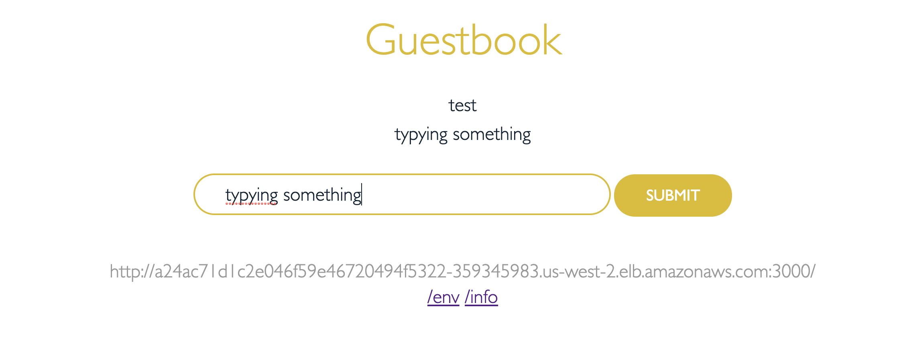
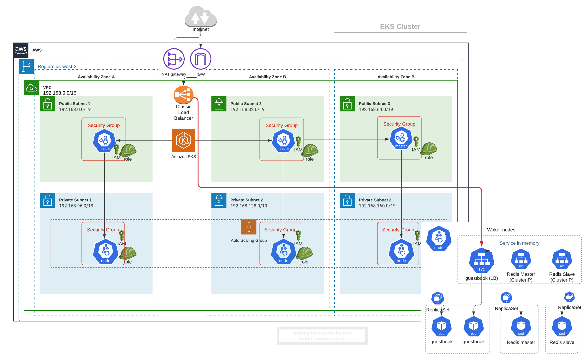

# 4. Deploy Sample App to EKS and Expose Service using Ingress

Refs: 
- https://github.com/kubernetes/examples/blob/master/guestbook-go/README.md


Frontend PHP app
- load balanced by public ELB
- read request load balanced to multiple slaves
- write request to a single master

Backend Redis
- single master (write)
- multi slaves (read)
- slaves sync continuously from master

## 4.1 Deploy Redis Master
```
kubectl apply -f https://raw.githubusercontent.com/kubernetes/examples/master/guestbook-go/redis-master-controller.json

kubectl apply -f https://raw.githubusercontent.com/kubernetes/examples/master/guestbook-go/redis-master-service.json
```

## 4.2 Deploy Redis Slave
```
kubectl apply -f https://raw.githubusercontent.com/kubernetes/examples/master/guestbook-go/redis-slave-controller.json

kubectl apply -f https://raw.githubusercontent.com/kubernetes/examples/master/guestbook-go/redis-slave-service.json
```

## 4.3 Deploy frontend app
```
kubectl apply -f https://raw.githubusercontent.com/kubernetes/examples/master/guestbook-go/guestbook-controller.json

kubectl apply -f https://raw.githubusercontent.com/kubernetes/examples/master/guestbook-go/guestbook-service.json
```

Show `replicationcontroller` (which is deprecated k8s resource succeeded by `replicaset` now)created
```
kubectl get replicationcontroller
```

Output
```
NAME           DESIRED   CURRENT   READY   AGE
guestbook      3         3         3       15m
redis-master   1         1         1       16m
redis-slave    2         2         2       15m
```

Get service and pod
```
kubectl get pod,service
```

Output
```
NAME                     READY   STATUS    RESTARTS   AGE
pod/guestbook-dxkpd      1/1     Running   0          16m
pod/guestbook-fsqx8      1/1     Running   0          16m
pod/guestbook-nnrjc      1/1     Running   0          16m
pod/redis-master-6dbj4   1/1     Running   0          17m
pod/redis-slave-c6wtv    1/1     Running   0          16m
pod/redis-slave-qccp6    1/1     Running   0          16m

NAME                   TYPE           CLUSTER-IP      EXTERN
AL-IP
       PORT(S)          AGE
service/guestbook      LoadBalancer   10.100.36.45    a24ac7
1d1c2e046f59e46720494f5322-359345983.us-west-2.elb.amazonaws
.com   3000:30604/TCP   15m
service/kubernetes     ClusterIP      10.100.0.1      <none>

       443/TCP          158m
service/redis-master   ClusterIP      10.100.174.46   <none>

       6379/TCP         17m
service/redis-slave    ClusterIP      10.100.103.40   <none>

       6379/TCP         16m
```


## 4.4 Get external ELB DNS
```sh
echo $(kubectl  get svc guestbook | awk '{ print $4 }' | tail -1):$(kubectl  get svc guestbook | awk '{ print $5 }' | tail -1 | cut -d ":" -f 1)

# output
a24ac71d1c2e046f59e46720494f5322-359345983.us-west-2.elb.amazonaws.com:3000
```

Visit it from browser __after 3-5 minutes when ELB is ready__




## 4.5 What Just Happened?!



## 4.6 Install Nginx Ingress Controller
```
kubectl create namespace nginx-ingress-controller

helm repo add stable https://kubernetes-charts.storage.googleapis.com/
helm repo update
helm install nginx-ingress-controller stable/nginx-ingress -n nginx-ingress-controller
```


## 4.7 Create Ingress resource for L7 load balancing by http hosts & paths

[ingress.yaml](ingress.yaml)
```yaml
apiVersion: extensions/v1beta1
  kind: Ingress
  metadata:
    annotations:
      kubernetes.io/ingress.class: nginx
    name: guestbook
    namespace: default
  spec:
    rules:
      - http:
          paths:
            - backend:
                serviceName: guestbook
                servicePort: 3000 
              path: /
```

Create ingress resource
```bash
kubectl apply -f ingress.yaml
```

Get the public DNS of AWS ELB created from the `nginx-ingress-controller-controller` service
```bash
kubectl  get svc nginx-ingress-controller-controller -n nginx-ingress-controller | awk '{ print $4 }' | tail -1
```

Output
```bash
# visit this from browser
a588cbec4e4e34e1bbc1cc066f38e3e0-1988798789.us-west-2.elb.amazonaws.com
```


## 4.8 Delete AWS ELB created by K8s Service of type LoadBalancer
Now modify `guestbook` service type from `LoadBalancer` to `NodePort`.

First get yaml 
```bash
kubectl get svc guestbook -o yaml
```

Output
```yaml
apiVersion: v1
kind: Service
metadata:
  annotations:
    kubectl.kubernetes.io/last-applied-configuration: |
      {"apiVersion":"v1","kind":"Service","metadata":{"annotations":{},"labels":{"app":"guestbook"},"name":"guestbook","namespace":"default"},"spec":{"ports":[{"port":3000,"targetPort":"http-server"}],"selector":{"app":"guestbook"},"type":"LoadBalancer"}}
  creationTimestamp: "2020-06-13T14:20:12Z"
  finalizers:
  - service.kubernetes.io/load-balancer-cleanup
  labels:
    app: guestbook
  name: guestbook
  namespace: default
  resourceVersion: "14757"
  selfLink: /api/v1/namespaces/default/services/guestbook
  uid: 24ac71d1-c2e0-46f5-9e46-720494f5322b
spec:
  clusterIP: 10.100.36.45
  externalTrafficPolicy: Cluster
  ports:
  - nodePort: 30604
    port: 3000
    protocol: TCP
    targetPort: http-server
  selector:
    app: guestbook
  sessionAffinity: None
  type: LoadBalancer
status:
  loadBalancer:
    ingress:
    - hostname: a24ac71d1c2e046f59e46720494f5322-359345983.us-west-2.elb.amazonaws.com
```

Strip out `status` etc that are added after created
[service_guestbook_nodeport.yaml](service_guestbook_nodeport.yaml)
```
apiVersion: v1
kind: Service
metadata:
  annotations:
  labels:
    app: guestbook
  name: guestbook
  namespace: default
spec:
  ports:
  - nodePort: 30605
    port: 3000
    protocol: TCP
    targetPort: http-server
  selector:
    app: guestbook
  type: NodePort
```

Delete the existing `guestbook` service as service is immutable
```bash
kubectl delete svc guestbook
```

Then apply new service
```bash
kubectl apply -f service_guestbook_nodeport.yaml
```

Check services in `default` namespace
```bash
$ kubectl get svc

NAME           TYPE        CLUSTER-IP      EXTERNAL-IP   PORT(S)          AGE
guestbook      NodePort    10.100.53.19    <none>        3000:30605/TCP   20s
kubernetes     ClusterIP   10.100.0.1      <none>        443/TCP          3h38m
redis-master   ClusterIP   10.100.174.46   <none>        6379/TCP         77m
redis-slave    ClusterIP   10.100.103.40   <none>        6379/TCP         76m
```

Lastly, check ingress controller's public DNS is reachable from browser
```bash
# visit the URL from browser
kubectl  get svc nginx-ingress-controller-controller -n nginx-ingress-controller | awk '{ print $4 }' | tail -1
```

## 4.9  What Just Happened?
1. Replaced `guestbook` service of type `LoadBalancer` to of `NodePort`
2. Front `guestbook` service with `nginx-ingress-controller` service of type `LoadBalancer`
3. `nginx-ingress-controller` pod will do L7 load balancing based on HTTP path and host
4. Now you can create multiple services and bind them to one ingress controller (one AWS ELB)

__Before Ingress__


__After Ingress__


__With Istio Enabled__

