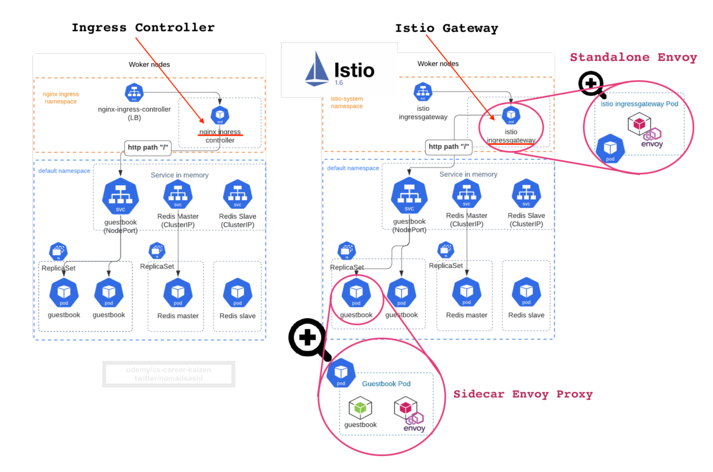
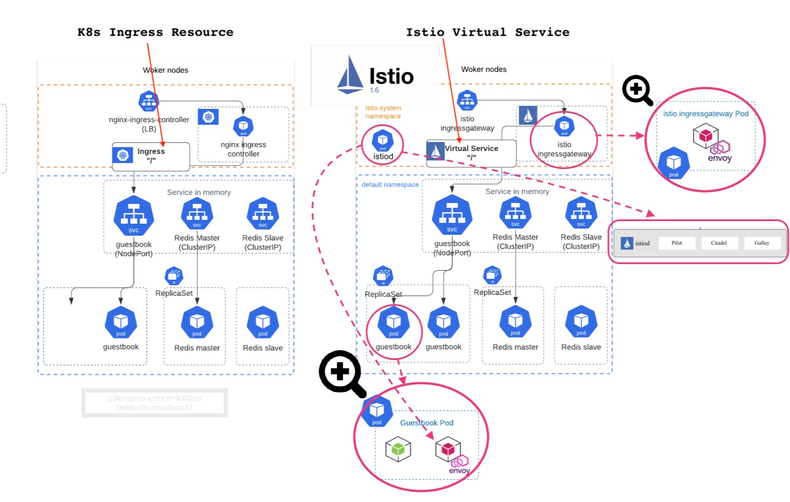
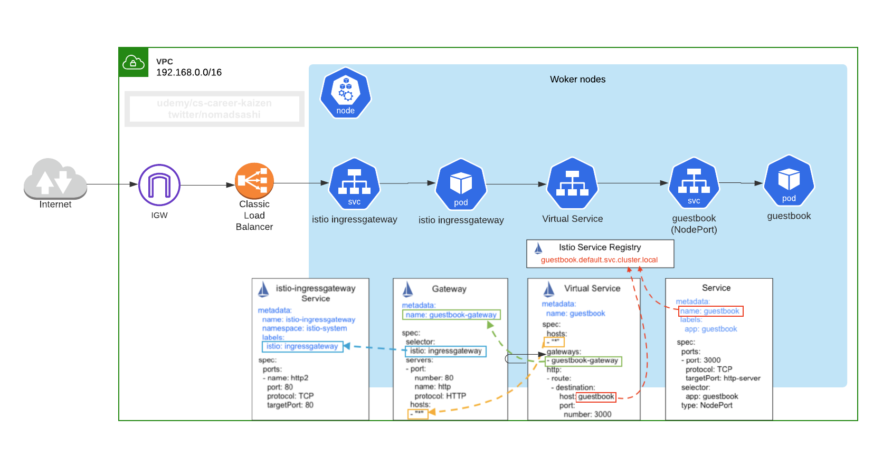
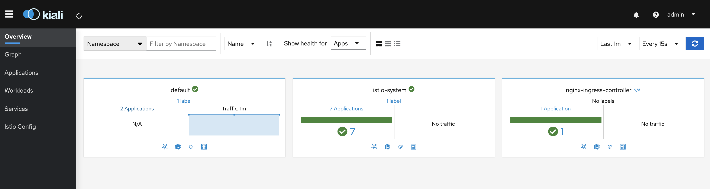
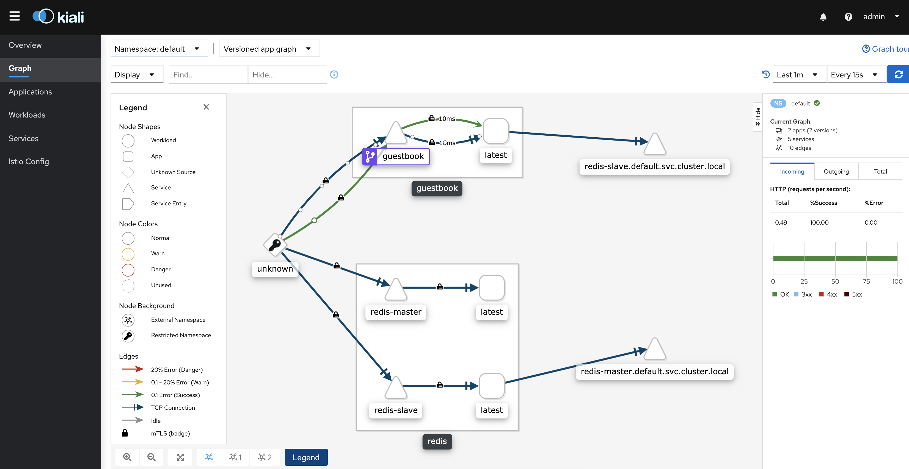
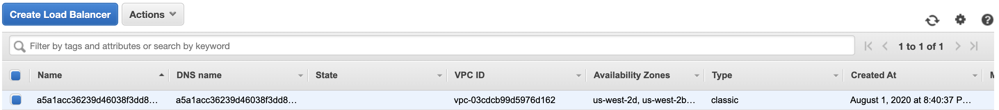
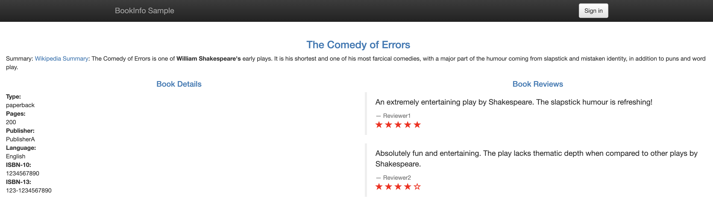
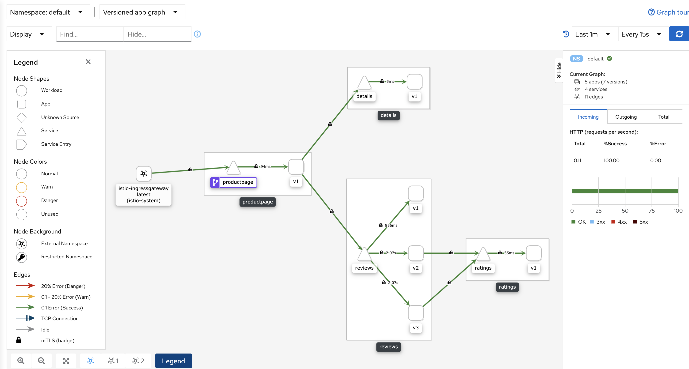

# 5. Expose Service using Istio VirtualService and Gateway (Transition from K8s Ingress to Istio Gateway)


# 5.1 What is Gateway
Refs:
- https://istio.io/latest/docs/reference/config/networking/gateway/
- https://istio.io/latest/docs/concepts/traffic-management/#gateways



Gateway is a load balancer:
> Gateway describes a load balancer operating at the edge of the mesh receiving incoming or outgoing HTTP/TCP connections

Also, gateway runs a __standalone__ Envoy proxy inside a pod:
> Gateway configurations are applied to standalone Envoy proxies that are running at the edge of the mesh, rather than sidecar Envoy proxies running alongside your service workloads.

Get ingressgateway pod in `istio-system`
```
kubectl get pod -n istio-system -l istio=ingressgateway
NAME                                    READY   STATUS    RESTARTS   AGE
istio-ingressgateway-5d869f5bbf-bvpxs   1/1     Running   0          7d20h
```

Notice `1/1`, there is only one container inside the pod and that is the __standalone envoy proxy__. If it's a __sidecar proxy__, then a pod would have two containers `2/2`.


It's similar to __AWS ELB Listener__ which defines __incoming__ ports, protocol, and target groups.

Gateway configures:
- set of ports that should be exposed
- type of protocol to use 
- SNI configuration for the load balancer
- TLS


# 5.2 Gateway Anatomy
For example, the below gateway YAML
- will be applied to the Envoy proxy running on a pod at the edge of mesh with labels `istio: ingressgateway`, which was preconfigured gateway proxy when installing istio of profile `demo`
- lets HTTP traffic from host "*" into the mesh on port 80

```yaml
apiVersion: networking.istio.io/v1alpha3
kind: Gateway
metadata:
  name: bookinfo-gateway
spec:
  selector: # select a standalone Envoy proxy running on a pod at the edge of service mesh
    istio: ingressgateway # use default istio gateway proxy in `istio-system` namespace
  servers:
  - port:
      number: 80  # define incoming port
      name: http # label assigned to the port
      protocol: HTTP # define incoming protocol, could be HTTP|HTTPS|GRPC|HTTP2|MONGO|TCP|TLS
    hosts: # hosts exposed by this gateway
    - "*"
```

- host
    - One or more hosts exposed by this gateway. While typically applicable to HTTP services, it can also be used for TCP services using TLS with SNI. A host is specified as a dnsName with an optional namespace/ prefix
    - A VirtualService must be bound to the gateway and __must have one or more hosts that match the hosts specified in a server__
- port
  - number
  - protocol
    - MUST BE one of HTTP|HTTPS|GRPC|HTTP2|MONGO|TCP|TLS
    - TLS implies the connection will be routed based on the SNI header to the destination without terminating the TLS connection (i.e. SSL Passthrough)
  - name: Label assigned to the port.


However, for the gateway to work as intended, you must also bind the gateway to a __virtual service__.

Analogy is something like below:
- AWS ELB Listener -> Istio Gateway
- AWS __ELB Target Group__ (defines L7 path/host, protocol, and backends) -> Istio __Virtual Service__ (defines L7 path/host, protocol, TLS, etc)


# 5.3 What is Virtual Service
Ref: https://istio.io/latest/docs/concepts/traffic-management/#virtual-services


Here is the 10,000 foot view:



Here is the linear view:


You can customize routing behaviours by using `VirtualService` to `tell Envoy how to send the virtual service’s traffic to appropriate destinations`.

For examples,
- 20% of calls go to the new version (canary)
- calls from these users go to version 2 (routing rules based on http header attribute)
- 30% of request will return HTTP 400 (fault injection)
- 10% of request will have timeout of 5 seconds introduced (timeout)
- etc


# 5.4 VirtualService Anatomy
Ref: https://istio.io/latest/docs/concepts/traffic-management/#virtual-service-example

Typical VirtualService yaml looks like this:
```yaml
apiVersion: networking.istio.io/v1alpha3
kind: VirtualService  # <--- kind is VirtualService
metadata:
  name: reviews
spec:
  hosts: # destinations that these routing rules apply to. This is a list of addresses the client uses when sending requests to the service.
  - reviews
  http:
  - match: # <---- condition
    - headers:
        end-user: # <--- routing rules based on http header attribute
          exact: jason
    route: # <---- routiung config
    - destination:
        host: reviews
        subset: v2
  - route: # <---- routiung config
    - destination:
        host: reviews # Kubernetes short name or FQDN
        subset: v3
```

- host
    - can be an IP address, a DNS name, Kubernetes service short name or FQDN, or wildcard (”*”) prefixes. When a short K8s name is evaluated, Istio __adds a domain suffix based on the namespace of the virtual service__ that contains the routing rule to get the fully qualified name for the host.
- http
    - Match condition
    - Route destination 
        -  specifies the actual destination for traffic that matches this condition. Unlike the virtual service’s host(s), the destination’s host must be a real destination that exists in Istio’s service registry or Envoy won’t know where to send traffic to it. This can be a mesh service with proxies or a __non-mesh service added using a service entry__ (such as AWS RDS endpoint, which isn't part of Istio Service Registry, hence it needs be added by creating Istio Service Entry resource)

#### Note: 
1. Using short names works ONLY IF both the destination hosts and the virtual service are actually in the same Kubernetes namespace
2. Routing rules are evaluated in __sequential order__ from top to bottom. This means in the above example,
```yaml
  http:
    - match: # <---- condition
        - headers:
            end-user: # <--- routing rules based on http header attribute
            exact: jason
        route: # <---- routiung config
        - destination:
            host: reviews
            subset: v2
    - route: # <---- default routiung config
        - destination:
            host: reviews # Kubernetes short name
            subset: v3
```
This list of routes is the last one, hence acting as the default backend just like the one in K8s ingress resource's default backend.


# 5.5 Deploy Istio Virtual Service (replacing K8s ingress resource) and Istio Gateway (replacing K8s ingress controller)

Mapping between K8s ingress controller, ingress resource, and Istio Gateway and Istio Virtual Service is as following:
- Ingress Controller -> Istio Gateway
- Ingress Resource -> Virtual Service


We have [gateway_guestbook.yaml](gateway_guestbook.yaml)
```yaml
apiVersion: networking.istio.io/v1alpha3
kind: Gateway
metadata:
  name: guestbook-gateway
  namespace: default
spec:
  selector:
    istio: ingressgateway # use default istio gateway proxy in `istio-system` namespace, which exposes it using K8s service of LoadBalancer, which creates AWS ELB
  servers: # defines L7 host, port, and protocol
  - port:
      number: 80
      name: http
      protocol: HTTP
    hosts: # host in http header
    - "*"
```

and [virtualservice_guestbook.yaml](virtualservice_guestbook.yaml)
```yaml
apiVersion: networking.istio.io/v1alpha3
kind: VirtualService
metadata:
  name: guestbook-virtualservice
  namespace: default
spec:
  hosts: # VirtualService must be bound to the gateway and must have one or more hosts that match the hosts specified in a server
  - "*"
  gateways: # using gateways field, it'll be exposed externally
  - guestbook-gateway.default.svc.cluster.local # this should match with gateway's name
  http:  # L7 load balancing by http path and host, just like K8s ingress resource
  - match:
    - uri:
        prefix: /
    route:
    - destination:
        host: guestbook.default.svc.cluster.local # specify service name, either by relative or absolute path
        port:
          number: 3000 # <--- guestbook service port
```

```sh
kubectl apply -f gateway_guestbook.yaml
kubectl apply -f virtualservice_guestbook.yaml

# check them
kubectl get virtualservice,gateway
```

Get istio ingressgateway service's external IP (i.e. AWS ELB DNS)
```sh
kubectl -n istio-system get service istio-ingressgateway -o jsonpath='{.status.loadBalancer.ingress[0].hostname}'

# curl public ELB endpoint
curl -v $(kubectl -n istio-system get service istio-ingressgateway -o jsonpath='{.status.loadBalancer.ingress[0].hostname}')

# output
* Rebuilt URL to: a5a1acc36239d46038f3dd828465c946-706040707.us-west-2.elb.amazonaws.com/
*   Trying 54.149.143.27...
* TCP_NODELAY set
* Connected to a5a1acc36239d46038f3dd828465c946-706040707.us-west-2.elb.amazonaws.com (54.149.143.27) port 80 (#0)
> GET / HTTP/1.1
> Host: a5a1acc36239d46038f3dd828465c946-706040707.us-west-2.elb.amazonaws.com
> User-Agent: curl/7.54.0
> Accept: */*
> 
< HTTP/1.1 200 OK
< accept-ranges: bytes
< content-length: 922
< content-type: text/html; charset=utf-8
< last-modified: Wed, 16 Dec 2015 18:26:32 GMT
< date: Sun, 02 Aug 2020 07:46:37 GMT
< x-envoy-upstream-service-time: 1
< server: istio-envoy
```

Check `kiali` dashboard
```
istioctl dashboard kiali
```



You will see that traffic is flowing from Virtual Service (purple icon) to backend guestbook pod with mutual TLS by default.




# 5.6 Uninstall Nginx Ingress Controller which will delete AWS ELB
Now that Istio Ingress Gateway is created, we no longer need K8s ingress controller. 

So let's unintall Nginx Ingress Controller
```sh
helm uninstall nginx-ingress-controller -n nginx-ingress-controller

# output
release "nginx-ingress-controller" uninstalled
```

Check all the resources are deleted in `nginx-ingress-controller` namespace
```sh
kubectl get all -n nginx-ingress-controller

# output
No resources found.

# delete namespace
kubectl delete ns nginx-ingress-controller
```

Now there should be only one AWS ELB created by istio ingressgateway service



Delete ingress resource
```
kubectl delete ingress guestbook
```

# 5.7 Deploy Another Bookinfo Sample app
First delete guestbook apps
```
kubectl delete rc,svc,vs,gateway,ingress --all
```

Deploy bookinfo
```sh
# create deployment and service
kubectl apply -f bookinfo.yaml 
```

Expose them using istio Gateway and VirtualService
```sh
# deploy ingress gateway and virtual service
kubectl apply -f gateway_bookinfo.yaml
kubectl apply -f virtualservice_bookinfo.yaml 
```

Curl the bookinfo endpoint
```
curl -v $(kubectl -n istio-system get service istio-ingressgateway -o jsonpath='{.status.loadBalancer.ingress[0].hostname}')/productpage
```

Or go to browser
```sh
echo $(kubectl -n istio-system get service istio-ingressgateway -o jsonpath='{.status.loadBalancer.ingress[0].hostname}')/productpage

# check this from browser
a5a1acc36239d46038f3dd828465c946-706040707.us-west-2.elb.amazonaws.com/productpage
```



Check Kiali dashboard


