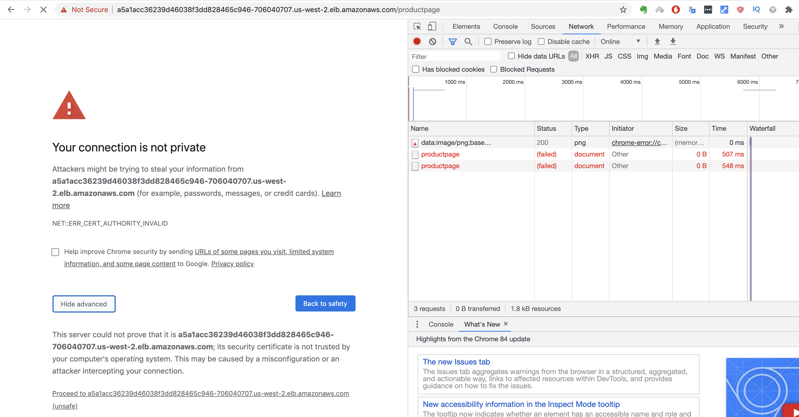
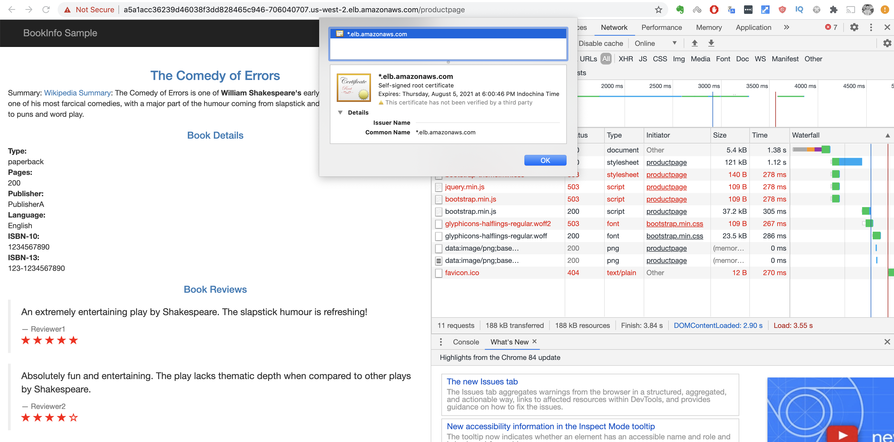
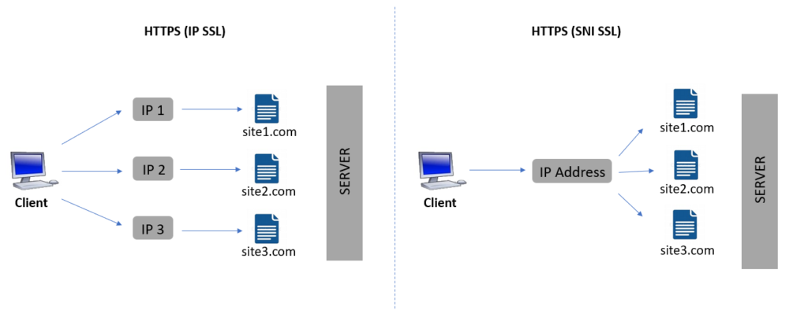
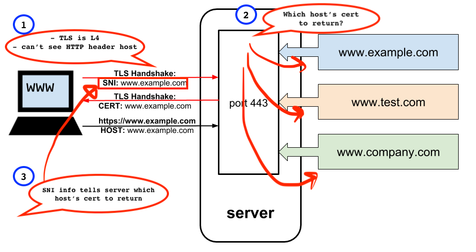
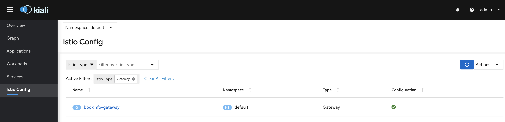
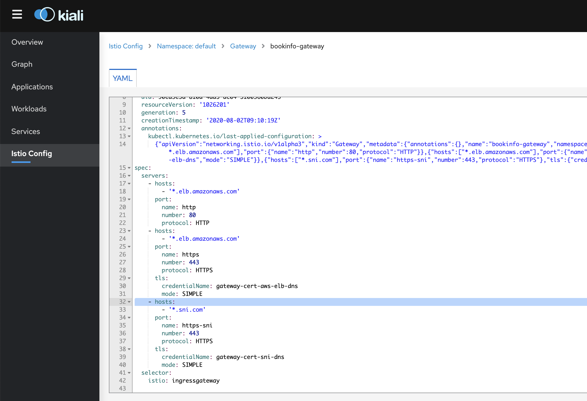
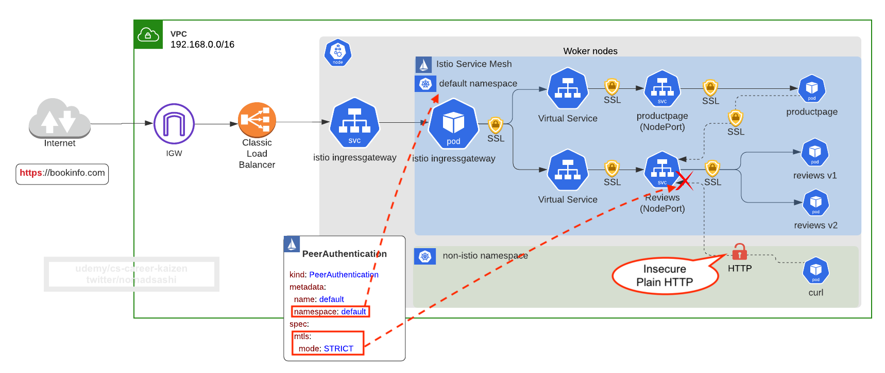

# Security in transit (HTTPS)

# 7.1 Enable HTTPS (TLS Termination) for Single Host using Istio Gateway
Refs:
- https://istio.io/latest/docs/reference/config/networking/gateway/
- https://istio.io/latest/docs/tasks/traffic-management/ingress/secure-ingress/


## Step 1: Create TLS Certificate

https://istio.io/latest/docs/tasks/traffic-management/ingress/ingress-control/#configuring-ingress-using-an-istio-gateway

Since we have no DNS binding for any DNS host in this course, we'll use `*.elb.amazonaws.com` for TLS cert's host.

```bash
# -x509: this option outputs a self signed certificate instead of a certificate request. This is typically used to generate a test certificate or a self signed root CA.
# -newkey rsa:2048: this option creates a new certificate request and a new private key. The argument takes one of several forms. rsa:nbits, where nbits is the number of bits, generates an RSA key nbits in size.
# -keyout: this gives the filename to write the newly created private key to.
# -out: This specifies the output filename to write to or standard output by default.
# -days: when the -x509 option is being used this specifies the number of days to certify the certificate for. The default is 30 days.
# -nodes: if this option is specified then if a private key is created it will not be encrypted.
openssl req \
        -x509 \
        -newkey rsa:2048 \
        -keyout istio-elb.amazonaws.com.key.pem \
        -out istio-elb.amazonaws.com.cert.pem \
        -days 365 \
        -nodes \
        -subj '/CN=*.elb.amazonaws.com'
```

Check contents of cert
```sh
openssl x509 -in istio-elb.amazonaws.com.cert.pem -text -noout

# output
Certificate:
    Data:
        Version: 1 (0x0)
        Serial Number: 15293043281836592574 (0xd43bcdd6bc8b4dbe)
    Signature Algorithm: sha256WithRSAEncryption
        Issuer: CN=*.elb.amazonaws.com
        Validity
            Not Before: Jun 14 09:10:37 2020 GMT
            Not After : Jun 14 09:10:37 2021 GMT
        Subject: CN=*.elb.amazonaws.com
        Subject Public Key Info:
            Public Key Algorithm: rsaEncryption
                Public-Key: (2048 bit)
```


## Step 2: Store TLS Cert in K8s Secret

Create secret `gateway-cert-aws-elb-dns` and specify TLS private key and cert file
```
kubectl create -n istio-system \
    secret tls gateway-cert-aws-elb-dns \
    --key=istio-elb.amazonaws.com.key.pem \
    --cert=istio-elb.amazonaws.com.cert.pem
```

## Step 3: Reference the TLS Secret from Istio Gateway YAML

In [gateway_https.yaml](gateway_https.yaml),
```yaml
apiVersion: networking.istio.io/v1alpha3
kind: Gateway
metadata:
  name: bookinfo-gateway
spec:
  selector:  # select a standalone Envoy proxy running on a pod at the edge of service mesh
    istio: ingressgateway # use default istio gateway proxy in `istio-system` namespace, which exposes it using K8s service of LoadBalancer, which creates AWS ELB
  servers: # defines L7 host, port, and protocol
  - port:
      number: 80 # define incoming port
      name: http # label assigned to the port
      protocol: HTTP # define incoming protocol, could be HTTP|HTTPS|GRPC|HTTP2|MONGO|TCP|
    hosts: # hosts exposed by this gateway
    - "*.elb.amazonaws.com"
  - port: # <---- port config for HTTPS
      number: 443
      name: https # label assigned to the port
      protocol: HTTPS # MUST BE one of HTTP|HTTPS|GRPC|HTTP2|MONGO|TCP|TLS. TLS implies the connection will be routed based on the SNI header to the destination without terminating the TLS connection. Ref: https://istio.io/latest/docs/reference/config/networking/gateway/#Port
    hosts:
    - "*.elb.amazonaws.com" # <----- host this gateway will accept for HTTPS port 443
    tls:
      mode: SIMPLE
      credentialName: gateway-cert-aws-elb-dns # fetches certs from Kubernetes secret
```

Notice new port config
```yaml
- port: # <---- port config for HTTPS
      number: 443
      name: https # label assigned to the port
      protocol: HTTPS # MUST BE one of HTTP|HTTPS|GRPC|HTTP2|MONGO|TCP|TLS. TLS implies the connection will be routed based on the SNI header to the destination without terminating the TLS connection. Ref: https://istio.io/latest/docs/reference/config/networking/gateway/#Port
    hosts:
    - "*.elb.amazonaws.com" # <----- host this gateway will accept for HTTPS port 443
    tls:
      mode: SIMPLE
      credentialName: gateway-cert-aws-elb-dns # fetches certs from Kubernetes secret
```


Apply
```
kubectl apply -f gateway_https.yaml
```

## Step 4: Test HTTPS

Curl https endpoint:
<details><summary>show</summary><p>

```sh
# pass -k or --insecure as we use self-signed insecure cert, --verbose for showing TSL handshale and cert and HTTP response
curl -k -v \
    https://$(echo $(kubectl -n istio-system get service istio-ingressgateway -o jsonpath='{.status.loadBalancer.ingress[0].hostname}')/productpage)

# successful output 
*   Trying 34.214.199.244...  # <---- AWS ELB DNS resolved to public IP
* TCP_NODELAY set
* Connected to a5a1acc36239d46038f3dd828465c946-706040707.us-west-2.elb.amazonaws.com (34.214.199.244) port 443 (#0)
* ALPN, offering h2
* ALPN, offering http/1.1
* Cipher selection: ALL:!EXPORT:!EXPORT40:!EXPORT56:!aNULL:!LOW:!RC4:@STRENGTH
* successfully set certificate verify locations:
*   CAfile: /etc/ssl/cert.pem
  CApath: none
* TLSv1.2 (OUT), TLS handshake, Client hello (1): # <----- TSL handshake begins
* TLSv1.2 (IN), TLS handshake, Server hello (2):
* TLSv1.2 (IN), TLS handshake, Certificate (11):
* TLSv1.2 (IN), TLS handshake, Server key exchange (12):
* TLSv1.2 (IN), TLS handshake, Server finished (14):
* TLSv1.2 (OUT), TLS handshake, Client key exchange (16):
* TLSv1.2 (OUT), TLS change cipher, Client hello (1):
* TLSv1.2 (OUT), TLS handshake, Finished (20):
* TLSv1.2 (IN), TLS change cipher, Client hello (1):
* TLSv1.2 (IN), TLS handshake, Finished (20):
* SSL connection using TLSv1.2 / ECDHE-RSA-CHACHA20-POLY1305
* ALPN, server accepted to use h2
* Server certificate: # <----- TSL cert content
*  subject: CN=*.elb.amazonaws.com # <----- TSL cert common name (domain)
*  start date: Aug  5 11:00:46 2020 GMT
*  expire date: Aug  5 11:00:46 2021 GMT
*  issuer: CN=*.elb.amazonaws.com
*  SSL certificate verify result: self signed certificate (18), continuing anyway.
* Using HTTP2, server supports multi-use
* Connection state changed (HTTP/2 confirmed)
* Copying HTTP/2 data in stream buffer to connection buffer after upgrade: len=0
* Using Stream ID: 1 (easy handle 0x7fec0500ba00)
> GET /productpage HTTP/2  # <----- HTTP Request Header contents
> Host: a5a1acc36239d46038f3dd828465c946-706040707.us-west-2.elb.amazonaws.com # <--- header host matching with *.us-west-2.elb.amazonaws.com
> User-Agent: curl/7.54.0
> Accept: */*
> 
* Connection state changed (MAX_CONCURRENT_STREAMS updated)! 
< HTTP/2 200   # <----- HTTP response
< content-type: text/html; charset=utf-8
< content-length: 5179
< server: istio-envoy
< date: Wed, 05 Aug 2020 11:24:39 GMT
< x-envoy-upstream-service-time: 30
< 
<!DOCTYPE html>
<html>
  <head>
    <title>Simple Bookstore App</title>
<meta name="viewport" content="width=device-width, initial-scale=1.0">
  </head>
  <body>
.
  </body>
</html>
* Connection #0 to host a5a1acc36239d46038f3dd828465c946-706040707.us-west-2.elb.amazonaws.com left intact
```
</p></details>

Visit the endpont from browser
```sh
echo $(kubectl -n istio-system get service istio-ingressgateway -o jsonpath='{.status.loadBalancer.ingress[0].hostname}')/productpage

# output
a5a1acc36239d46038f3dd828465c946-706040707.us-west-2.elb.amazonaws.com/productpage
```






# 7.2 Enable HTTPS (TLS Termination) for MULTIPLE Host (SNI) using Istio Gateway
Ref: https://istio.io/latest/docs/tasks/traffic-management/ingress/secure-ingress/#configure-a-tls-ingress-gateway-for-multiple-hosts

In previous section, we enabled HTTPS for `*.us-west-2.elb.amazonaws.com`.

What if we want to expose another domain, say `test.sni.com` using this gateway?

This is the case where we need to use SNI (Server Name Invocation).


## Step 1: What is SNI (Server Name Invocation)

SNI allows a single gateway/load balancer/proxy to host __multiple TLS certificates__ on the __same IP__.




In previous section, we enabled HTTPS for `*.us-west-2.elb.amazonaws.com` for gateway.
Which means:
```
gateway IP --> `*.us-west-2.elb.amazonaws.com`
```

If we want to add TLS cert for `test.sni.com`:
```
gateway IP --> `*.us-west-2.elb.amazonaws.com`
          |
           -->  `test.sni.com`
```

This is the case where the gateway hosts __multiple TLS certificates__ on the __same IP__.


## Step 2: Why SNI?



1. TLS/SSL is __Transport layer (L4)__, meaning it's not Application Layer (L7) which includes __HTTP__ protocol
2. Gateway provides __TLS cert based on host__ attribute, but with __TLS (L4) there is no HTTP header (L7) info__
3. With __SNI info__, Gateway now knows which TSL cert to provide to client during TLS handshake


## Step 3: Create Another TLS Cert 
Generate self-signed root, intermediary CA, and server certs and keys
```sh
# -x509: this option outputs a self signed certificate instead of a certificate request. This is typically used to generate a test certificate or a self signed root CA.
# -newkey rsa:2048: this option creates a new certificate request and a new private key. The argument takes one of several forms. rsa:nbits, where nbits is the number of bits, generates an RSA key nbits in size.
# -keyout: this gives the filename to write the newly created private key to.
# -out: This specifies the output filename to write to or standard output by default.
# -days: when the -x509 option is being used this specifies the number of days to certify the certificate for. The default is 30 days.
# -nodes: if this option is specified then if a private key is created it will not be encrypted.
openssl req \
        -x509 \
        -newkey rsa:2048 \
        -keyout istio-elb.sni.com.key.pem \
        -out istio-elb.sni.com.cert.pem \
        -days 365 \
        -nodes \
        -subj '/CN=*.sni.com'  # <----- new domain
```

Check contents of cert
```sh
openssl x509 -in istio-elb.sni.com.cert.pem -text -noout

# output
Certificate:
    Data:
        Version: 1 (0x0)
        Serial Number: 11192186715375109859 (0x9b52a284d5c786e3)
    Signature Algorithm: sha256WithRSAEncryption
        Issuer: CN=*.sni.com # <---- Cert's common name is set to *.sni.com
        Validity
            Not Before: Aug  7 06:27:30 2020 GMT
            Not After : Aug  7 06:27:30 2021 GMT
        Subject: CN=*.sni.com
        Subject Public Key Info:
            Public Key Algorithm: rsaEncryption
                Public-Key: (2048 bit)
```


## Step 4: Store TLS Cert in K8s Secret

Create secret `gateway-cert-sni-dns` and specify TLS private key and cert file
```
kubectl create -n istio-system \
    secret tls gateway-cert-sni-dns \
    --key=istio-elb.sni.com.key.pem \
    --cert=istio-elb.sni.com.cert.pem
```

## Step 5: Reference the TLS Secret from Istio Gateway YAML

In [gateway_https_sni.yaml](gateway_https_sni.yaml),
```yaml
apiVersion: networking.istio.io/v1alpha3
kind: Gateway
metadata:
  name: bookinfo-gateway
spec:
  selector: 
    istio: ingressgateway
  servers: 
  - port:
      number: 80 
      name: http 
      protocol: HTTP 
    hosts: 
    - "*.elb.amazonaws.com"
  - port: 
      number: 443
      name: https 
      protocol: HTTPS
    hosts:
    - "*.elb.amazonaws.com"
    tls:
      mode: SIMPLE
      credentialName: gateway-cert-aws-elb-dns
  - port: # <------ new server config added for *.sni.com
      number: 443
      name: https-sni # <----- must be unique name among other port's name
      protocol: HTTPS # MUST BE one of HTTP|HTTPS|GRPC|HTTP2|MONGO|TCP|TLS. TLS implies the connection will be routed based on the SNI header to the destination without terminating the TLS connection. Ref: https://istio.io/latest/docs/reference/config/networking/gateway/#Port
    hosts:
    - "*.sni.com" # <----- add new host
    tls:
      mode: SIMPLE
      credentialName: gateway-cert-sni-dns # fetches certs from Kubernetes secret created earlier
```

Notice new item in list of servers 
```yaml
  - port: # <------ new server config added for *.sni.com
      number: 443
      name: https-sni # <----- must be unique name among other port's name
      protocol: HTTPS # MUST BE one of HTTP|HTTPS|GRPC|HTTP2|MONGO|TCP|TLS. TLS implies the connection will be routed based on the SNI header to the destination without terminating the TLS connection. Ref: https://istio.io/latest/docs/reference/config/networking/gateway/#Port
    hosts:
    - "*.sni.com" # <----- add new host
    tls:
      mode: SIMPLE
      credentialName: gateway-cert-sni-dns # fetches certs from Kubernetes secret created earlier
```


Apply
```
kubectl apply -f gateway_https_sni.yaml
```

You can check if config is correct or not from `Kiali` Dashboard actually:
```
istioctl dashboard kiali
```





## Step 6: Add *.sni.com to Virtual Service Host

In [virtual_service_httpbin_sni.yaml](virtual_service_httpbin_sni.yaml), let's add a new domain `*.sni.com`:
```yaml
apiVersion: networking.istio.io/v1alpha3
kind: VirtualService
metadata:
  name: httpbin
spec:
  hosts:
  - "*.elb.amazonaws.com"
  - httpbin
  - "*.sni.com" # <----- apply virtual service config to this host as well
  gateways: 
  - bookinfo-gateway 
  http: 
  - match:
    - uri:
        exact: /
      ignoreUriCase: true
    - uri:
        exact: /ip
      ignoreUriCase: true
    - uri:
        exact: /headers
      ignoreUriCase: true
    route:
    - destination:
        host: httpbin.default.svc.cluster.local
        port:
          number: 80
```

Notice new host `*.sni.com` is added
```yaml
spec:
  hosts: 
  - "*.elb.amazonaws.com"
  - httpbin
  - "*.sni.com" # <----- apply virtual service config to this host as well
```

Apply
```
kubectl apply -f virtual_service_httpbin_sni.yaml 
```

```sh
# create httpbin pod
kubectl apply -f pod_httpbin.yaml

# expose httpbin pod internally  
kubectl expose pod httpbin --port 80
```


## Step 7: Test HTTPS for *.sni.com

### BEFORE SNI
First make sure there is no regression (didn't break anything from previous section)

<details><summary>show</summary><p>

```sh
# -k or --insecure for self-signed insecure cert
# --verbose for showing TSL handshale and cert and HTTP response
curl -k -v \
    https://$(echo $(kubectl -n istio-system get service istio-ingressgateway -o jsonpath='{.status.loadBalancer.ingress[0].hostname}')/productpage)

# this is the same thing
curl -k -v \
  "https://a5a1acc36239d46038f3dd828465c946-706040707.us-west-2.elb.amazonaws.com/productpage" 

# or you can pass -HHost with "*.elb.amazonaws.com" as well
curl \
  -HHost:test.elb.amazonaws.com \
  --resolve "test.elb.amazonaws.com:$SECURE_INGRESS_PORT:$(host $(echo $INGRESS_HOST) | tail -1 | awk '{ print $4 }')" \
  "https://test.elb.amazonaws.com:$SECURE_INGRESS_PORT/productpage" 

# successful output 
*   Trying 34.214.199.244...  # <---- AWS ELB DNS resolved to public IP
* TCP_NODELAY set
* Connected to a5a1acc36239d46038f3dd828465c946-706040707.us-west-2.elb.amazonaws.com (34.214.199.244) port 443 (#0)
* ALPN, offering h2
* ALPN, offering http/1.1
* Cipher selection: ALL:!EXPORT:!EXPORT40:!EXPORT56:!aNULL:!LOW:!RC4:@STRENGTH
* successfully set certificate verify locations:
*   CAfile: /etc/ssl/cert.pem
  CApath: none
* TLSv1.2 (OUT), TLS handshake, Client hello (1): # <----- TSL handshake begins
* TLSv1.2 (IN), TLS handshake, Server hello (2):
* TLSv1.2 (IN), TLS handshake, Certificate (11):
* TLSv1.2 (IN), TLS handshake, Server key exchange (12):
* TLSv1.2 (IN), TLS handshake, Server finished (14):
* TLSv1.2 (OUT), TLS handshake, Client key exchange (16):
* TLSv1.2 (OUT), TLS change cipher, Client hello (1):
* TLSv1.2 (OUT), TLS handshake, Finished (20):
* TLSv1.2 (IN), TLS change cipher, Client hello (1):
* TLSv1.2 (IN), TLS handshake, Finished (20):
* SSL connection using TLSv1.2 / ECDHE-RSA-CHACHA20-POLY1305
* ALPN, server accepted to use h2
* Server certificate: # <----- TSL cert content
*  subject: CN=*.elb.amazonaws.com # <----- TSL cert common name (domain)
*  start date: Aug  5 11:00:46 2020 GMT
*  expire date: Aug  5 11:00:46 2021 GMT
*  issuer: CN=*.elb.amazonaws.com
*  SSL certificate verify result: self signed certificate (18), continuing anyway.
* Using HTTP2, server supports multi-use
* Connection state changed (HTTP/2 confirmed)
* Copying HTTP/2 data in stream buffer to connection buffer after upgrade: len=0
* Using Stream ID: 1 (easy handle 0x7fec0500ba00)
> GET /productpage HTTP/2  # <----- HTTP Request Header contents
> Host: a5a1acc36239d46038f3dd828465c946-706040707.us-west-2.elb.amazonaws.com # <--- header host matching with *.us-west-2.elb.amazonaws.com
> User-Agent: curl/7.54.0
> Accept: */*
> 
* Connection state changed (MAX_CONCURRENT_STREAMS updated)! 
< HTTP/2 200   # <----- HTTP response
< content-type: text/html; charset=utf-8
< content-length: 5179
< server: istio-envoy
< date: Wed, 05 Aug 2020 11:24:39 GMT
< x-envoy-upstream-service-time: 30
< 
```
</p></details>

Notice which TLS cert is being used and what HTTP header host value is:
```sh
* Server certificate: # <----- TSL cert content
*  subject: CN=*.elb.amazonaws.com # <----- TSL cert common name (domain)

> Host: a5a1acc36239d46038f3dd828465c946-706040707.us-west-2.elb.amazonaws.com # <--- header host matching with *.us-west-2.elb.amazonaws.com
```


### AFTER SNI
Now access gateway (i.e. AWS ELB public DNS), but with `*.sni.com` domain so that gateway would return TLS cert for `*.sni.com`, instead of `*.elb.amazonaws.com`

<details><summary>show</summary><p>

```sh
# WARNING: if $INGRESS_HOST resolves to DNS host not IP, then passing --resolve to resolve "test.sni.com:$SECURE_INGRESS_PORT" part with $INGRESS_HOST does NOT work
# you need to resolve $INGRESS_HOST DNS to IP by replacing it with $(host $(echo $INGRESS_HOST) | tail -1 | awk '{ print $4 }')
# ref: https://unix.stackexchange.com/questions/33121/curl-resolve-appears-to-do-nothing

# both works for "*.sni.com" domain, with or without passing -HHost

SECURE_INGRESS_PORT=443
export INGRESS_HOST=$(echo $(kubectl -n istio-system get service istio-ingressgateway -o jsonpath='{.status.loadBalancer.ingress[0].hostname}'))
echo $INGRESS_HOST

curl -v \
  -HHost:test.sni.com \
  --resolve "test.sni.com:$SECURE_INGRESS_PORT:$(host $(echo $INGRESS_HOST) | tail -1 | awk '{ print $4 }')" \
  "https://test.sni.com:$SECURE_INGRESS_PORT/headers" -k

curl -v \
  --resolve "test.sni.com:$SECURE_INGRESS_PORT:$(host $(echo $INGRESS_HOST) | tail -1 | awk '{ print $4 }')" \
  "https://test.sni.com:$SECURE_INGRESS_PORT/headers" -k

# this is not working because $INGRESS_HOST is not public IP, just DNS.
curl -v \
  --resolve "test.sni.com:$SECURE_INGRESS_PORT:$INGRESS_HOST" \
  "https://test.sni.com:$SECURE_INGRESS_PORT/headers" -k


# output
* Added test.sni.com:443:54.149.143.27 to DNS cache
* Hostname test.sni.com was found in DNS cache
*   Trying 54.149.143.27... # <---- public IP of AWS ELB DNS
* TCP_NODELAY set
* Connected to test.sni.com (54.149.143.27) port 443 (#0)
* ALPN, offering h2
* ALPN, offering http/1.1
* Cipher selection: ALL:!EXPORT:!EXPORT40:!EXPORT56:!aNULL:!LOW:!RC4:@STRENGTH
* successfully set certificate verify locations:
*   CAfile: /etc/ssl/cert.pem
  CApath: none
* TLSv1.2 (OUT), TLS handshake, Client hello (1):
* TLSv1.2 (IN), TLS handshake, Server hello (2):
* TLSv1.2 (IN), TLS handshake, Certificate (11):
* TLSv1.2 (IN), TLS handshake, Server key exchange (12):
* TLSv1.2 (IN), TLS handshake, Server finished (14):
* TLSv1.2 (OUT), TLS handshake, Client key exchange (16):
* TLSv1.2 (OUT), TLS change cipher, Client hello (1):
* TLSv1.2 (OUT), TLS handshake, Finished (20):
* TLSv1.2 (IN), TLS change cipher, Client hello (1):
* TLSv1.2 (IN), TLS handshake, Finished (20):
* SSL connection using TLSv1.2 / ECDHE-RSA-CHACHA20-POLY1305
* ALPN, server accepted to use h2
* Server certificate:
*  subject: C=US; ST=Denial; L=Springfield; O=Dis; CN=*.sni.com # <---- using *.sni.com cert!
*  start date: Aug  7 13:53:39 2020 GMT
*  expire date: Aug 17 13:53:39 2021 GMT
*  issuer: C=US; ST=Denial; O=Dis; CN=*.sni.com
*  SSL certificate verify result: unable to get local issuer certificate (20), continuing anyway.
* Using HTTP2, server supports multi-use
* Connection state changed (HTTP/2 confirmed)
* Copying HTTP/2 data in stream buffer to connection buffer after upgrade: len=0
* Using Stream ID: 1 (easy handle 0x7f855400ba00)
> GET /headers HTTP/2
> Host:test.sni.com # <----- 
> User-Agent: curl/7.54.0
> Accept: */*
> 
* Connection state changed (MAX_CONCURRENT_STREAMS updated)!
< HTTP/2 200  # <----- HTTP 200 returned
< server: istio-envoy
< date: Sat, 08 Aug 2020 07:59:07 GMT
< content-type: application/json
< content-length: 1631
< access-control-allow-origin: *
< access-control-allow-credentials: true
< x-envoy-upstream-service-time: 11
< 
{
  "headers": {
    "Accept": "*/*", 
    "Content-Length": "0", 
    "Host": "test.sni.com", 
    "User-Agent": "curl/7.54.0", 
    "X-B3-Sampled": "1", 
    "X-B3-Spanid": "acedc44ac22f6042", 
    "X-B3-Traceid": "efb45dc018cf5851acedc44ac22f6042", 
    "X-Envoy-Decorator-Operation": "httpbin.default.svc.cluster.local:80/headers", 
    "X-Envoy-Internal": "true", 
    "X-Envoy-Peer-Metadata": "ChoKCkNMVVNURVJfSUQSDBoKS3ViZXJuZXRlcwofCgxJTlNUQU5DRV9JUFMSDxoNMTkyLjE2OC42Ni43NAqWAgoGTEFCRUxTEosCKogCCh0KA2FwcBIWGhRpc3Rpby1pbmdyZXNzZ2F0ZXdheQoTCgVjaGFydBIKGghnYXRld2F5cwoUCghoZXJpdGFnZRIIGgZUaWxsZXIKGQoFaXN0aW8SEBoOaW5ncmVzc2dhdGV3YXkKIQoRcG9kLXRlbXBsYXRlLWhhc2gSDBoKNWQ4NjlmNWJiZgoSCgdyZWxlYXNlEgcaBWlzdGlvCjkKH3NlcnZpY2UuaXN0aW8uaW8vY2Fub25pY2FsLW5hbWUSFhoUaXN0aW8taW5ncmVzc2dhdGV3YXkKLwojc2VydmljZS5pc3Rpby5pby9jYW5vbmljYWwtcmV2aXNpb24SCBoGbGF0ZXN0ChoKB01FU0hfSUQSDxoNY2x1c3Rlci5sb2NhbAovCgROQU1FEicaJWlzdGlvLWluZ3Jlc3NnYXRld2F5LTVkODY5ZjViYmYtYnZweHMKGwoJTkFNRVNQQUNFEg4aDGlzdGlvLXN5c3RlbQpdCgVPV05FUhJUGlJrdWJlcm5ldGVzOi8vYXBpcy9hcHBzL3YxL25hbWVzcGFjZXMvaXN0aW8tc3lzdGVtL2RlcGxveW1lbnRzL2lzdGlvLWluZ3Jlc3NnYXRld2F5CqcBChFQTEFURk9STV9NRVRBREFUQRKRASqOAQogCg5hd3NfYWNjb3VudF9pZBIOGgwxNjQ5MjU1OTYzMTUKJQoVYXdzX2F2YWlsYWJpbGl0eV96b25lEgwaCnVzLXdlc3QtMmQKKAoPYXdzX2luc3RhbmNlX2lkEhUaE2ktMDQ3Yzc0MTQ3NjZhZjIwNmUKGQoKYXdzX3JlZ2lvbhILGgl1cy13ZXN0LTIKOQoPU0VSVklDRV9BQ0NPVU5UEiYaJGlzdGlvLWluZ3Jlc3NnYXRld2F5LXNlcnZpY2UtYWNjb3VudAonCg1XT1JLTE9BRF9OQU1FEhYaFGlzdGlvLWluZ3Jlc3NnYXRld2F5", 
    "X-Envoy-Peer-Metadata-Id": "router~192.168.66.74~istio-ingressgateway-5d869f5bbf-bvpxs.istio-system~istio-system.svc.cluster.local"
  }
}
* Connection #0 to host test.sni.com left intact
```
</p></details>


__NON-WORKING__ Curl Examples:
```sh
# not working: "sni.com" doesn't work for "*.sni.com" cert common name
curl -v \
  --resolve "sni.com:$SECURE_INGRESS_PORT:$(host $(echo $INGRESS_HOST) | tail -1 | awk '{ print $4 }')" \
  "https://sni.com:$SECURE_INGRESS_PORT/headers" -k

# not working: curl: (6) Could not resolve host: test.sni.com
# you need to resolve $INGRESS_HOST DNS to IP by replacing it with $(host $(echo $INGRESS_HOST) | tail -1 | awk '{ print $4 }')
curl -v \
  -HHost:test.sni.com \
  --cacert istio-elb.sni.com.cert.pem \
  --resolve "test.sni.com:$SECURE_INGRESS_PORT:$INGRESS_HOST" \
  "https://test.sni.com:$SECURE_INGRESS_PORT/headers"


# not working, using "sni.com" instead of "*.sni.com" 
# error: error:14009108:SSL routines:CONNECT_CR_KEY_EXCH:wrong signature length
curl -v \
  -HHost:sni.com \
  --resolve "sni.com:$SECURE_INGRESS_PORT:$INGRESS_HOST" \
  "https://sni.com:$SECURE_INGRESS_PORT/headers" -k
```


# 7.3 Verify Mutual TLS among Apps inside Istio Service Mesh
Ref:
- https://istio.io/latest/docs/tasks/security/authentication/authn-policy/#auto-mutual-tls


> all traffic between workloads with proxies uses mutual TLS, without you doing anything


When using mutual TLS, the proxy injects the X-Forwarded-Client-Cert header to the upstream request to the backend. That header’s presence is evidence that mutual TLS is used.

Make a curl request from `curl` pod to `httpbin`
```sh
# create YAML for curl pod
kubectl run curl \
    --restart Never \
    --image curlimages/curl \
    --dry-run -o yaml \
    -- /bin/sh -c "sleep infinity" > pod_curl.yaml

# apply
kubectl apply -f pod_curl.yaml


# from curl container, curl httpbin service and grep for "X-Forwarded-Client-Cert"
kubectl exec -it curl sh
curl httpbin/headers | grep -I X-Forwarded-Client-Cert

# output 
"X-Forwarded-Client-Cert": "By=spiffe://cluster.local/ns/default/sa/default;Hash=d251b241c9b4f51b5d596e7d32e46916e7dc7d3b087b633412e6e2eaea738d5f;Subject=\"\";URI=spiffe://cluster.local/ns/default/sa/default"
```

The fact that `X-Forwarded-Client-Cert` is injected by istio sidecar proxy inside curl pod when making a request to `httpbin` pod means mutual TLS is enabled among apps (in the namespaces where istio sidecar injection is enabled) in the mesh
```sh
# from curl container, curl httpbin
curl httpbin/headers

# output
{
  "headers": {
    "Accept": "*/*", 
    "Content-Length": "0", 
    "Host": "httpbin", 
    "User-Agent": "curl/7.71.1-DEV", 
    "X-B3-Parentspanid": "0a649da2f5a4b574", 
    "X-B3-Sampled": "1", 
    "X-B3-Spanid": "66c68ec9f592c922", 
    "X-B3-Traceid": "2259a9fb0ad227650a649da2f5a4b574", 
    "X-Envoy-Attempt-Count": "1", 
    "X-Forwarded-Client-Cert": "By=spiffe://cluster.local/ns/default/sa/default;Hash=d251b241c9b4f51b5d596e7d32e46916e7dc7d3b087b633412e6e2eaea738d5f;Subject=\"\";URI=spiffe://cluster.local/ns/default/sa/default" # <----- client cert injected to request header for mutual TLS
  }
```


# 7.4 Enable STRICT Mutual-TLS in Mesh Globally (all namespaces)
Ref:
- https://istio.io/latest/docs/tasks/security/authentication/authn-policy/#globally-enabling-istio-mutual-tls-in-strict-mode

> While Istio automatically upgrades all traffic between the proxies and the workloads to mutual TLS between, __workloads can still receive plain text traffic__. To prevent non-mutual TLS for the whole mesh, set a mesh-wide peer authentication policy to set mutual TLS mode to STRICT.


## BEFORE STRICT MODE

You can send non-mutual TLS traffic from `curl` pod to `httpbin` pod:
```sh
# create a new namespace, without enabling istio sidecar injection
kubectl create ns non-istio

# create YAML for curl pod in non-istio namespace
kubectl run curl \
    --restart Never \
    --image curlimages/curl \
    -n non-istio \
    --dry-run -o yaml \
    -- /bin/sh -c "sleep infinity" > pod_curl_non_istio.yaml

# apply
kubectl apply -f pod_curl_non_istio.yaml

kubectl get pod -n non-istio

# output shows there is only one container in curl pod, verifyiing there is no istio sidecar envoy proxy container in the pod
NAME   READY   STATUS    RESTARTS   AGE
curl   1/1     Running   0          12s


# curl httpbin in default namespace from curl coontainer in non-istio namespace
kubectl exec -it curl -n non-istio sh
curl httpbin.default/headers | grep -I X-Forwarded-Client-Cert

# returns no result since this pod doesn't have istio sidecar, hence no client cert was injected to request header to httpbin

# however, it can connect to istio-enabled httpbin pod in default namespace
curl httpbin.default/headers -I

# output shows HTTP 200
HTTP/1.1 200 OK
server: istio-envoy
date: Wed, 05 Aug 2020 13:34:30 GMT
content-type: application/json
content-length: 264
access-control-allow-origin: *
access-control-allow-credentials: true
x-envoy-upstream-service-time: 2
x-envoy-decorator-operation: httpbin.default.svc.cluster.local:80/*
```

## AFTER STRICT MODE

In [peer_authentication_strict_mutual_tls_global.yaml](peer_authentication_strict_mutual_tls_global.yaml),
```yaml
apiVersion: security.istio.io/v1beta1
kind: PeerAuthentication
metadata:
  name: default
  namespace: istio-system
  # namespace: default # namespace-wide policy

spec:
  mtls:
    mode: STRICT # configures all workloads in the mesh to only accept requests encrypted with TLS
```

Apply
```sh
kubectl apply -f peer_authentication_strict_mutual_tls_global.yaml
```

Now try to send non-mutual TLS traffic from `curl` pod to `httpbin` pod
```sh
# curl httpbin in default namespace from curl coontainer in non-istio namespace
kubectl exec -it curl -n non-istio sh
curl httpbin.default/headers -v

# expected output shows connection failure
*   Trying 10.100.88.82:80...
* Connected to httpbin.default (10.100.88.82) port 80 (#0)
> GET /headers HTTP/1.1
> Host: httpbin.default
> User-Agent: curl/7.71.1-DEV
> Accept: */*
> 
* Recv failure: Connection reset by peer
* Closing connection 0
curl: (56) Recv failure: Connection reset by peer
```


# 7.5 Enable STRICT Mutual-TLS in Mesh Per Namespace
Ref:
- https://istio.io/latest/docs/tasks/security/authentication/authn-policy/#enable-mutual-tls-per-workload





First disable global `PeerAuthentication` config we just created in `istio-system` namespace
```
kubectl delete pa default -n istio-system
```


In [peer_authentication_strict_mutual_tls_default_ns.yaml](peer_authentication_strict_mutual_tls_default_ns.yaml), we are going to apply STRICT mutual TLS __incoming requests__ to `default` namespace
```yaml
apiVersion: security.istio.io/v1beta1
kind: PeerAuthentication
metadata:
  name: default
  namespace: default # namespace-wide policy
spec:
  mtls:
    mode: STRICT # configures all workloads in the mesh to only accept requests encrypted with TLS
```

Apply
```sh
kubectl apply -f peer_authentication_strict_mutual_tls_default_ns.yaml
```

Verify non-mutual TLS request is still blocked from `non-istio` namespace to `httpbin` in `default` namespace
```sh
# curl httpbin in default namespace from curl coontainer in non-istio namespace
kubectl exec -it curl -n non-istio sh
curl httpbin.default/headers -v

# expected output shows connection failure
*   Trying 10.100.88.82:80...
* Connected to httpbin.default (10.100.88.82) port 80 (#0)
> GET /headers HTTP/1.1
> Host: httpbin.default
> User-Agent: curl/7.71.1-DEV
> Accept: */*
> 
* Recv failure: Connection reset by peer
* Closing connection 0
curl: (56) Recv failure: Connection reset by peer
```


Now create `httpbin` in new `istio-enabled` namespace
```sh
kubectl create ns istio-enabled

# enable istio
kubectl label namespace istio-enabled istio-injection=enabled
```

Verify non-mutual TLS request is __NOT blocked__ from `non-istio` namespace to `httpbin` in `istio-enabled` namespace
```sh
# create httpbin pod in istio-enabled namespace, which doesn't have STRICT mutual TLS
kubectl run httpbin \
    --restart Never \
    -n istio-enabled \
    --image docker.io/kennethreitz/httpbin

# expose httpbin pod internally  
kubectl expose pod httpbin --port 80 -n istio-enabled

kubectl exec -it curl -n non-istio sh
curl httpbin.istio-enabled/headers -v

# output shows request succeeded
*   Trying 10.100.32.14:80...
* Connected to httpbin.istio-enabled (10.100.32.14) port 80 (#0)
> GET /headers HTTP/1.1
> Host: httpbin.istio-enabled
> User-Agent: curl/7.71.1-DEV
> Accept: */*
> 
* Mark bundle as not supporting multiuse
< HTTP/1.1 200 OK # <----- http 200
< server: istio-envoy
< date: Wed, 05 Aug 2020 13:58:16 GMT
< content-type: application/json
< content-length: 270
< access-control-allow-origin: *
< access-control-allow-credentials: true
< x-envoy-upstream-service-time: 3 
< x-envoy-decorator-operation: httpbin.istio-enabled.svc.cluster.local:80/*
< 
{
  "headers": {
    "Accept": "*/*", 
    "Content-Length": "0", 
    "Host": "httpbin.istio-enabled", 
    "User-Agent": "curl/7.71.1-DEV", 
    "X-B3-Sampled": "1", 
    "X-B3-Spanid": "c5561cfb1526907d", 
    "X-B3-Traceid": "9bc6798b367798b7c5561cfb1526907d" # <----- there is no client cert from this pod, meaning non-mutual TLS plain request was sent from curl container
  }
}
* Connection #0 to host httpbin.istio-enabled left intact
```


# 7.6 Enable STRICT Mutual-TLS in Mesh Per Workload In Namespace
Ref:
- https://istio.io/latest/docs/tasks/security/authentication/authn-policy/#policy-precedence

> A workload-specific peer authentication policy takes precedence over a namespace-wide policy.


## BEFORE STRICT MODE PER WORKLOAD

You can __not__ send non-mutual TLS traffic from `curl` pod to `httpbin` pod in `default` namespace:
```sh
# curl httpbin in default namespace from curl coontainer in non-istio namespace
kubectl exec -it curl -n non-istio sh

# expected to fail due to STRICT mutual TLS config
curl httpbin.default/headers -I

# expected to fail for all the requests to pod in default namespace
curl productpage.default:9080 -I

# output
curl: (56) Recv failure: Connection reset by peer


# expected to succeed for non-default namespace
curl httpbin.istio-enabled/headers -I
```

## AFTER STRICT MODE PER WORKLOAD

First disable `PeerAuthentication` config we just created in `default` namespace
```
kubectl delete pa default -n default
```

In [peer_authentication_strict_mutual_tls_httpbin.yaml](peer_authentication_strict_mutual_tls_httpbin.yaml), we configure STRICT mutual TLS for all the incoming requests to pods with label `app: httpbin` only in `default` namespace:
```yaml
apiVersion: security.istio.io/v1beta1
kind: PeerAuthentication
metadata:
  name: default
  namespace: default # namespace-wide policy
spec:
  selector:
    matchLabels:
      run: httpbin # <---- config applied to incoming request to this pod label
  mtls:
    mode: STRICT # configures all workloads in the mesh to only accept requests encrypted with TLS
```

Also need to create Destination Rule because Istio cannot aggregate workload-level policies for outbound mutual TLS traffic to a service.

In [destinationrule_strict_mutual_tls_httpbin.yaml](destinationrule_strict_mutual_tls_httpbin.yaml),
```yaml
apiVersion: networking.istio.io/v1alpha3
kind: DestinationRule
metadata:
  name: httpbin
spec:
  host: httpbin.default # <--- specify outgoing request to which host that config will be applied to
  trafficPolicy:
    tls: 
      mode: ISTIO_MUTUAL # <---- strict mutual TLS required to the specified destination host
```

Apply
```
kubectl apply -f destinationrule_strict_mutual_tls_httpbin.yaml 
kubectl apply -f peer_authentication_strict_mutual_tls_httpbin.yaml
```

Verify that non-mutual TLS request to `httpbin` in `default` namespace is still blocked, but `productpage` in `default` namespace is __NOT__.
```sh
# curl httpbin in default namespace from curl coontainer in non-istio namespace
kubectl exec -it curl -n non-istio sh

# expected to fail due to STRICT mutual TLS config for `httpbin` workload in default namespace
curl httpbin.default/headers -I
# output
curl: (56) Recv failure: Connection reset by peer

# expected to SUCCEED for all the requests to pod except "run: httpbin" label in default namespace
curl productpage.default:9080 -I

# output
HTTP/1.1 200 OK
content-type: text/html; charset=utf-8
content-length: 1683
server: istio-envoy
date: Wed, 05 Aug 2020 14:32:25 GMT
x-envoy-upstream-service-time: 11
x-envoy-decorator-operation: productpage.default.svc.cluster.local:9080/*


# expected to succeed for non-default namespace
curl httpbin.istio-enabled/headers -I
```


# 7.7 Enable HTTP Redirect to HTTPS
Ref: https://istio.io/docs/reference/config/networking/gateway/

In [gateway_https_sni_https_redirect.yaml](gateway_https_sni_https_redirect.yaml), redirect port 80 to port 443:
```sh
  servers: # defines L7 host, port, and protocol
  - port:
      number: 80
      name: http
      protocol: HTTP
    hosts: # host in http header
    - "a1abfd566d68643928e9ee352211f89a-1032923527.us-east-1.elb.amazonaws.com"
    tls:
      httpsRedirect: true # sends 301 redirect for http requests
```

Apply
```
kubectl apply -f gateway_https_sni_https_redirect.yaml
```

Test
```sh
curl -v \
    http://$(echo $(kubectl -n istio-system get service istio-ingressgateway -o jsonpath='{.status.loadBalancer.ingress[0].hostname}')/headers)

# should get HTTP 301

# follow redirect and pass -k for insecure
curl -v \
    http://$(echo $(kubectl -n istio-system get service istio-ingressgateway -o jsonpath='{.status.loadBalancer.ingress[0].hostname}')/headers) -L -k

# output 
*   Trying 54.149.45.218...
* TCP_NODELAY set
* Connected to aa763752bdc8e4907bcd5746efe95b9c-1399209693.us-west-2.elb.amazonaws.com (54.149.45.218) port 80 (#0)
> GET /headers HTTP/1.1
> Host: aa763752bdc8e4907bcd5746efe95b9c-1399209693.us-west-2.elb.amazonaws.com
> User-Agent: curl/7.54.0
> Accept: */*
> 
< HTTP/1.1 301 Moved Permanently
< location: https://aa763752bdc8e4907bcd5746efe95b9c-1399209693.us-west-2.elb.amazonaws.com/headers
< date: Thu, 20 Aug 2020 20:19:46 GMT
< server: istio-envoy
< content-length: 0
< 
* Connection #0 to host aa763752bdc8e4907bcd5746efe95b9c-1399209693.us-west-2.elb.amazonaws.com left intact
* Issue another request to this URL: 'https://aa763752bdc8e4907bcd5746efe95b9c-1399209693.us-west-2.elb.amazonaws.com/headers'
*   Trying 54.149.45.218...
* TCP_NODELAY set
* Connected to aa763752bdc8e4907bcd5746efe95b9c-1399209693.us-west-2.elb.amazonaws.com (54.149.45.218) port 443 (#1)
* ALPN, offering h2
* ALPN, offering http/1.1
* Cipher selection: ALL:!EXPORT:!EXPORT40:!EXPORT56:!aNULL:!LOW:!RC4:@STRENGTH
* successfully set certificate verify locations:
*   CAfile: /etc/ssl/cert.pem
  CApath: none
* TLSv1.2 (OUT), TLS handshake, Client hello (1):
* TLSv1.2 (IN), TLS handshake, Server hello (2):
* TLSv1.2 (IN), TLS handshake, Certificate (11):
* TLSv1.2 (IN), TLS handshake, Server key exchange (12):
* TLSv1.2 (IN), TLS handshake, Server finished (14):
* TLSv1.2 (OUT), TLS handshake, Client key exchange (16):
* TLSv1.2 (OUT), TLS change cipher, Client hello (1):
* TLSv1.2 (OUT), TLS handshake, Finished (20):
* TLSv1.2 (IN), TLS change cipher, Client hello (1):
* TLSv1.2 (IN), TLS handshake, Finished (20):
* SSL connection using TLSv1.2 / ECDHE-RSA-CHACHA20-POLY1305
* ALPN, server accepted to use h2
* Server certificate:
*  subject: CN=*.elb.amazonaws.com
*  start date: Aug 20 17:51:18 2020 GMT
*  expire date: Aug 20 17:51:18 2021 GMT
*  issuer: CN=*.elb.amazonaws.com
*  SSL certificate verify result: self signed certificate (18), continuing anyway.
* Using HTTP2, server supports multi-use
* Connection state changed (HTTP/2 confirmed)
* Copying HTTP/2 data in stream buffer to connection buffer after upgrade: len=0
* Using Stream ID: 1 (easy handle 0x7fdac280ba00)
> GET /headers HTTP/2
> Host: aa763752bdc8e4907bcd5746efe95b9c-1399209693.us-west-2.elb.amazonaws.com
> User-Agent: curl/7.54.0
> Accept: */*
> 
* Connection state changed (MAX_CONCURRENT_STREAMS updated)!
< HTTP/2 200 
< server: istio-envoy
< date: Thu, 20 Aug 2020 20:19:47 GMT
< content-type: application/json
< content-length: 1690
< access-control-allow-origin: *
< access-control-allow-credentials: true
< x-envoy-upstream-service-time: 5
< 
{
  "headers": {
    "Accept": "*/*", 
    "Content-Length": "0", 
    "Host": "aa763752bdc8e4907bcd5746efe95b9c-1399209693.us-west-2.elb.amazonaws.com", 
    "User-Agent": "curl/7.54.0", 
    "X-B3-Sampled": "1", 
    "X-B3-Spanid": "48cc131fc275de57", 
    "X-B3-Traceid": "c7bdb23dbb04d5b848cc131fc275de57", 
    "X-Envoy-Decorator-Operation": "httpbin.default.svc.cluster.local:80/headers", 
    "X-Envoy-Internal": "true", 
    "X-Envoy-Peer-Metadata": "ChoKCkNMVVNURVJfSUQSDBoKS3ViZXJuZXRlcwofCgxJTlNUQU5DRV9JUFMSDxoNMTkyLjE2OC4xMy4zNwqWAgoGTEFCRUxTEosCKogCCh0KA2FwcBIWGhRpc3Rpby1pbmdyZXNzZ2F0ZXdheQoTCgVjaGFydBIKGghnYXRld2F5cwoUCghoZXJpdGFnZRIIGgZUaWxsZXIKGQoFaXN0aW8SEBoOaW5ncmVzc2dhdGV3YXkKIQoRcG9kLXRlbXBsYXRlLWhhc2gSDBoKODQ5Yzc2ZDk1OQoSCgdyZWxlYXNlEgcaBWlzdGlvCjkKH3NlcnZpY2UuaXN0aW8uaW8vY2Fub25pY2FsLW5hbWUSFhoUaXN0aW8taW5ncmVzc2dhdGV3YXkKLwojc2VydmljZS5pc3Rpby5pby9jYW5vbmljYWwtcmV2aXNpb24SCBoGbGF0ZXN0ChoKB01FU0hfSUQSDxoNY2x1c3Rlci5sb2NhbAovCgROQU1FEicaJWlzdGlvLWluZ3Jlc3NnYXRld2F5LTg0OWM3NmQ5NTktcDVkOWIKGwoJTkFNRVNQQUNFEg4aDGlzdGlvLXN5c3RlbQpdCgVPV05FUhJUGlJrdWJlcm5ldGVzOi8vYXBpcy9hcHBzL3YxL25hbWVzcGFjZXMvaXN0aW8tc3lzdGVtL2RlcGxveW1lbnRzL2lzdGlvLWluZ3Jlc3NnYXRld2F5CqcBChFQTEFURk9STV9NRVRBREFUQRKRASqOAQogCg5hd3NfYWNjb3VudF9pZBIOGgwxNjQ5MjU1OTYzMTUKJQoVYXdzX2F2YWlsYWJpbGl0eV96b25lEgwaCnVzLXdlc3QtMmQKKAoPYXdzX2luc3RhbmNlX2lkEhUaE2ktMDVhZDk3ZTI0NzllZmRkNGUKGQoKYXdzX3JlZ2lvbhILGgl1cy13ZXN0LTIKOQoPU0VSVklDRV9BQ0NPVU5UEiYaJGlzdGlvLWluZ3Jlc3NnYXRld2F5LXNlcnZpY2UtYWNjb3VudAonCg1XT1JLTE9BRF9OQU1FEhYaFGlzdGlvLWluZ3Jlc3NnYXRld2F5", 
    "X-Envoy-Peer-Metadata-Id": "router~192.168.13.37~istio-ingressgateway-849c76d959-p5d9b.istio-system~istio-system.svc.cluster.local"
  }
}
```

