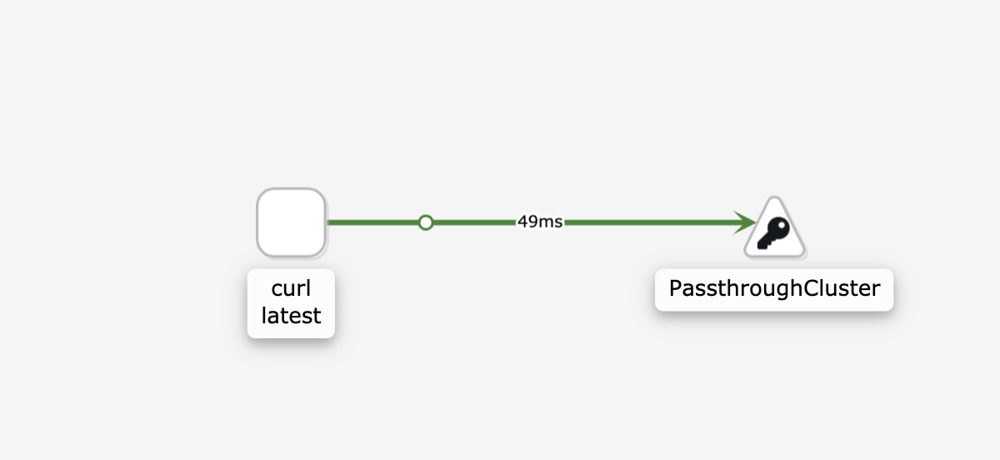
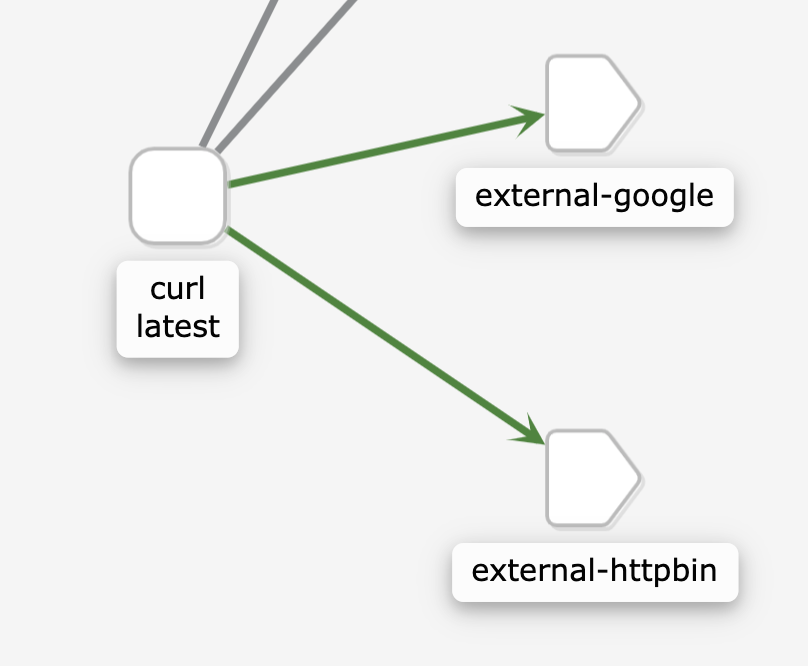

# 9. Engress Security using ServiceEntry

Ref:
- https://istio.io/latest/docs/tasks/traffic-management/egress/egress-control/#envoy-passthrough-to-external-services

There are three different modes for Egress traffic:
1. (__default__ for `demo` profile) Allow the Envoy proxy to __pass requests through__ to services that are not configured inside the mesh.
2. Configure service entries to provide controlled access to external services.
3. Completely bypass the Envoy proxy for a specific range of IPs.


> ALLOW_ANY is the default value, allowing you to start evaluating Istio quickly, without controlling access to external services

However, by default you lose Istio monitoring and control for traffic to external services.


## Test Default Pass Through for Egress
Get a shell inside curl pod and curl `www.google.com`
```sh
kubectl exec -it curl -n non-istio sh
curl www.google.com -I

# output 
HTTP/1.1 200 OK
Content-Type: text/html; charset=ISO-8859-1
P3P: CP="This is not a P3P policy! See g.co/p3phelp for more info."
Date: Sat, 08 Aug 2020 14:09:03 GMT
Server: gws
X-XSS-Protection: 0
X-Frame-Options: SAMEORIGIN
Transfer-Encoding: chunked
Expires: Sat, 08 Aug 2020 14:09:03 GMT
Cache-Control: private
Set-Cookie: 1P_JAR=2020-08-08-14; expires=Mon, 07-Sep-2020 14:09:03 GMT; path=/; domain=.google.com; Secure
Set-Cookie: NID=204=TuCCwEx9UXjigWGEVcfJQZlyqLnmHn91yCTaAxjtbFfmzdTJ5HO6_GW7Kq_K3UuKF3V02PO_udk41yAKiqEEtfiP5a0XT08vRawUUQbH-newck8gkLPIzca9_slpuutN_XmhO1_ASnf00X5g_qD-oLk3PvLe4pC2ur8IY_-trvc; expires=Sun, 07-Feb-2021 14:09:03 GMT; path=/; domain=.google.com; HttpOnly
```

In `kiali` dashboard, you will see this



# 9.1 Register External URL using ServiceEntry

## BEFORE

From a curl container, access `httpbin.org/headers`
```sh
kubectl exec -it curl sh

curl http://httpbin.org/headers
# output
{
  "headers": {
    "Accept": "*/*", 
    "Content-Length": "0", 
    "Host": "httpbin.org", 
    "User-Agent": "curl/7.71.1-DEV", 
    "X-Amzn-Trace-Id": "Root=1-5f2eb912-f2277b001719c0a887f8f7d0", 
    "X-B3-Sampled": "1", 
    "X-B3-Spanid": "95af8293e68d385b", 
    "X-B3-Traceid": "f1b2518a2400ef3195af8293e68d385b", 
    "X-Envoy-Attempt-Count": "1", 
    "X-Envoy-Peer-Metadata": "ChoKCkNMVVNURVJfSUQSDBoKS3ViZXJuZXRlcwogCgxJTlNUQU5DRV9JUFMSEBoOMTkyLjE2OC43Ny4xMTIKugEKBkxBQkVMUxKvASqsAQoZCgxpc3Rpby5pby9yZXYSCRoHZGVmYXVsdAoNCgNydW4SBhoEY3VybAokChlzZWN1cml0eS5pc3Rpby5pby90bHNNb2RlEgcaBWlzdGlvCikKH3NlcnZpY2UuaXN0aW8uaW8vY2Fub25pY2FsLW5hbWUSBhoEY3VybAovCiNzZXJ2aWNlLmlzdGlvLmlvL2Nhbm9uaWNhbC1yZXZpc2lvbhIIGgZsYXRlc3QKGgoHTUVTSF9JRBIPGg1jbHVzdGVyLmxvY2FsCg4KBE5BTUUSBhoEY3VybAoWCglOQU1FU1BBQ0USCRoHZGVmYXVsdAo8CgVPV05FUhIzGjFrdWJlcm5ldGVzOi8vYXBpcy92MS9uYW1lc3BhY2VzL2RlZmF1bHQvcG9kcy9jdXJsChwKD1NFUlZJQ0VfQUNDT1VOVBIJGgdkZWZhdWx0ChcKDVdPUktMT0FEX05BTUUSBhoEY3VybA==", 
    "X-Envoy-Peer-Metadata-Id": "sidecar~192.168.77.112~curl.default~default.svc.cluster.local"
  }
}
```

## AFTER
Create a ServiceEntry to allow access to an external HTTP service `google.com` and `httpbin.org`.

In [service_entry_google.com](service_entry_google.com),
```yaml
apiVersion: networking.istio.io/v1alpha3
kind: ServiceEntry
metadata:
  name: external-google
spec:
  hosts:
  - google.com # must be FQDN
  - www.google.com
  ports:
  - number: 80
    name: http
    protocol: HTTP
  - number: 443
    name: https
    protocol: HTTPS
  resolution: DNS
  location: MESH_EXTERNAL
---
apiVersion: networking.istio.io/v1alpha3
kind: ServiceEntry
metadata:
  name: external-httpbin
spec:
  hosts:
  - httpbin.org # <----- for httpbin domain
  ports:
  - number: 80
    name: http
    protocol: HTTP
  - number: 443
    name: https
    protocol: HTTPS
  resolution: DNS
  location: MESH_EXTERNAL
```

Apply
```
kubectl apply -f service_entry_google.yaml 
```

From a curl container, access `google.com`, `httbin.org`, and `appl.com`
```sh
kubectl exec -it curl sh

# access google
curl www.google.com

# access httpbin
curl http://httpbin.org/headers
# output
{
  "headers": {
    "Accept": "*/*", 
    "Content-Length": "0", 
    "Host": "httpbin.org", 
    "User-Agent": "curl/7.71.1-DEV", 
    "X-Amzn-Trace-Id": "Root=1-5f2eb947-b8cecf407ff76800c5201900", 
    "X-B3-Sampled": "1", 
    "X-B3-Spanid": "b17f5421562140a7", 
    "X-B3-Traceid": "ef45b3cfa9c8c81cb17f5421562140a7", 
    "X-Envoy-Attempt-Count": "1", 
    "X-Envoy-Decorator-Operation": "httpbin.org:80/*", 
    "X-Envoy-Peer-Metadata": "ChoKCkNMVVNURVJfSUQSDBoKS3ViZXJuZXRlcwogCgxJTlNUQU5DRV9JUFMSEBoOMTkyLjE2OC43Ny4xMTIKugEKBkxBQkVMUxKvASqsAQoZCgxpc3Rpby5pby9yZXYSCRoHZGVmYXVsdAoNCgNydW4SBhoEY3VybAokChlzZWN1cml0eS5pc3Rpby5pby90bHNNb2RlEgcaBWlzdGlvCikKH3NlcnZpY2UuaXN0aW8uaW8vY2Fub25pY2FsLW5hbWUSBhoEY3VybAovCiNzZXJ2aWNlLmlzdGlvLmlvL2Nhbm9uaWNhbC1yZXZpc2lvbhIIGgZsYXRlc3QKGgoHTUVTSF9JRBIPGg1jbHVzdGVyLmxvY2FsCg4KBE5BTUUSBhoEY3VybAoWCglOQU1FU1BBQ0USCRoHZGVmYXVsdAo8CgVPV05FUhIzGjFrdWJlcm5ldGVzOi8vYXBpcy92MS9uYW1lc3BhY2VzL2RlZmF1bHQvcG9kcy9jdXJsChwKD1NFUlZJQ0VfQUNDT1VOVBIJGgdkZWZhdWx0ChcKDVdPUktMT0FEX05BTUUSBhoEY3VybA==", 
    "X-Envoy-Peer-Metadata-Id": "sidecar~192.168.77.112~curl.default~default.svc.cluster.local"
  }
}

# access apple.com (not registered with ServiceEntry)
curl apple.com -I -L
```

Notice headers `X-Envoy-Decorator-Operation` is added by the Istio sidecar proxy from httpbin response:
```json
"X-Envoy-Decorator-Operation": "httpbin.org:80/*", 
```

Check the istio sidecar proxy's log inside curl pod
```sh
kubectl logs curl -c istio-proxy | tail

# google.com
[2020-08-08T14:41:49.896Z] "GET / HTTP/1.1" 301 - "-" "-" 0 219 31 31 "-" "curl/7.71.1-DEV" "38bb64b2-fc64-9f00-a745-c468747fb0ee" "google.com" "172.217.3.206:80" outbound|80||google.com 192.168.77.112:55708 172.217.3.206:80 192.168.77.112:55706 - default

# httpbin.org
[2020-08-08T14:41:39.447Z] "GET /headers HTTP/1.1" 200 - "-" "-" 0 1135 72 72 "-" "curl/7.71.1-DEV" "11727077-f912-9635-bb39-e61a0fc6d152" "httpbin.org" "54.236.246.173:80" outbound|80||httpbin.org 192.168.77.112:40152 3.220.112.94:80 192.168.77.112:32790 - default

# apple.com
[2020-08-08T14:45:32.584Z] "HEAD / HTTP/1.1" 301 - "-" "-" 0 0 156 156 "-" "curl/7.71.1-DEV" "04b5245d-e015-98a6-95c3-97cd387936b8" "apple.com" "17.172.224.47:80" PassthroughCluster 192.168.77.112:48844 17.172.224.47:80 192.168.77.112:48842 - allow_any
```

Notice `outbound|80||google.com ` for `google.com` whereas `PassthroughCluster` for `apple.com` in the log.

In `kiali` dashboard, `external-google` and `external-httpbin` service entry will appear



# 9.2 Set Timeout for External Service
Ref: https://istio.io/latest/docs/tasks/traffic-management/egress/egress-control/#manage-traffic-to-external-services


Similar to inter-cluster requests, __Istio routing rules__ can also be set for __external services__ that are accessed using ServiceEntry configurations. In this example, you set a __timeout rule__ on calls to the httpbin.org service.

In [virtual_service_httpbin_timeout.yaml](virtual_service_httpbin_timeout.yaml), set a 3s timeout on calls to the httpbin.org external service.

__WARNING__: if selecting `bookinfo-gateway` for `gateways`, this won't work. Make sure to either add `mesh` to `gateways` or completely omit `gateways` in which case it'll default to mesh wise (i.e. gateway and mesh).

```yaml
apiVersion: networking.istio.io/v1alpha3
kind: VirtualService
metadata:
  name: httpbin-org
spec:
  hosts: # destinations that these routing rules apply to. VirtualService must be bound to the gateway and must have one or more hosts that match the hosts specified in a server
  - httpbin.org
  # gateways: # names of gateways and sidecars that should apply these routes
  # - bookinfo-gateway # <----- don't select ingress gateway, as we want to apply timeout config for sidecar envoy proxy, not edge proxy for ingress
  http: 
  - timeout: 3s
    route:
      - destination:
          host: httpbin.org # <---- destinaton can be internal or external, as long as in service registry
        weight: 100
```

Apply
```
kubectl apply -f virtual_service_httpbin_timeout.yaml
```

From a curl container, access `httpbin.org/delay/5` which will return after 5 second sleep
```sh
kubectl exec -it curl sh

# use time command to show latency
# hit httpbin endpoint "/delay/5" meaning it returns in 5 second
time curl httpbin.org/delay/5 -I

# output
HTTP/1.1 504 Gateway Timeout # <------ HTTP 504
content-length: 24
content-type: text/plain
date: Sat, 08 Aug 2020 16:35:36 GMT
server: envoy

real    0m 3.00s # <----- timed out in 3 second due to VirtualService config
user    0m 0.00s
sys     0m 0.00s
```

This time a 504 (Gateway Timeout) appears after 3 seconds. Although httpbin.org was waiting 5 seconds, Istio cut off the request at 3 seconds.


# 9.3 TLS Origination for External Service using DestinationRule
Ref: https://istio.io/latest/docs/tasks/traffic-management/egress/egress-tls-origination/

## BEFORE

Let's access `http://www.apple.com:80` from within the service mesh (i.e. from inside curl container). What's gonna happen is it will respond with `HTTP 301: Moved Permanently`.

If you pass `curl -L` flag of curl which instructs curl to follow redirects so that `www.apple.com:80` gets redirected to `https://www.apple.com:443`.

```sh
kubectl exec -it curl sh

curl www.apple.com -I -L

# first HTTP request
HTTP/1.1 301 Moved Permanently # <------ 301
server: envoy
content-length: 0
location: https://www.apple.com/ # <------ redirected to https
cache-control: max-age=0
expires: Sat, 08 Aug 2020 17:05:20 GMT
date: Sat, 08 Aug 2020 17:05:20 GMT
strict-transport-security: max-age=31536000
set-cookie: geo=US; path=/; domain=.apple.com
set-cookie: ccl=QO0eGkc3ptNP9wG4TcYeqLpwm47hI4Fn2D1OgPu2lWC0l4e8+u4NcbyLmWf2dYE9stLV3SW1GVKt0GN9ux4DEKwFB1xjgLhYHB4sKrxAkm8PTWq6PoAD5HAL3a5QX4SrluWpftjq3OARqync1M+C5ngjPFWBgvdYyMjYLo63908=; path=/; domain=.apple.com
x-envoy-upstream-service-time: 19

# second HTTP request
HTTP/2 200 
server: Apache
x-frame-options: SAMEORIGIN
x-xss-protection: 1; mode=block
accept-ranges: bytes
x-content-type-options: nosniff
content-type: text/html; charset=UTF-8
strict-transport-security: max-age=31536000; includeSubDomains
content-length: 69376
cache-control: max-age=254
expires: Sat, 08 Aug 2020 16:54:51 GMT
date: Sat, 08 Aug 2020 16:50:37 GMT
set-cookie: geo=US; path=/; domain=.apple.com
```

This means __two HTTP requests__ were sent.

With __TLS origination__, we can __eliminate a redundant 2nd HPTT request__ for redirection.


## AFTER

### Step 1: Create ServiceEntry for external "apple.com" so we can control requests

In [service_entry_apple.yaml](service_entry_apple.yaml), define both port 80 and 443
```yaml
apiVersion: networking.istio.io/v1alpha3
kind: ServiceEntry
metadata:
  name: apple-com
spec:
  hosts:
  - apple.com
  - www.apple.com
  ports:
  - number: 80
    name: http-port
    protocol: HTTP
  - number: 443
    name: https-port-for-tls-origination
    protocol: HTTPS
  resolution: DNS
```

Apply
```
kubectl apply -f service_entry_apple.yaml
```


### Step 2: Create VirtualService for "apple.com" and Associate it with Subset defined in DestinationRule

```yaml
apiVersion: networking.istio.io/v1alpha3
kind: VirtualService
metadata:
  name: apple-com
spec:
  hosts:
  - "*.apple.com"
  http:
  - match:
    - port: 80 # <----- match with port 80 request, and send it to DestinationRule's subset called "tls-origination" at port 443
    route:
    - destination:
        host: www.apple.com
        subset: tls-origination
        port:
          number: 443
```

Apply
```
kubectl apply -f virtual_service_apple.yaml
```


### Step 3: Create DestinationRule to Initiate TLS connection

```yaml
apiVersion: networking.istio.io/v1alpha3
kind: DestinationRule
metadata:
  name: apple-com
spec:
  host: www.apple.com
  subsets:
  - name: tls-origination
    trafficPolicy:
      loadBalancer:
        simple: ROUND_ROBIN
      portLevelSettings:
      - port:
          number: 443
        tls:
          mode: SIMPLE # initiates HTTPS when accessing apple.com
```

Apply
```
kubectl apply -f destination_rule_apple_tls.yaml
```

### Step 4: Test Accessing External "apple.com"

```sh
kubectl exec -it curl sh

curl www.apple.com -I

# successful output
HTTP/1.1 200 OK # <----- no redirection to https required
server: envoy
x-frame-options: SAMEORIGIN
x-xss-protection: 1; mode=block
accept-ranges: bytes
x-content-type-options: nosniff
content-type: text/html; charset=UTF-8
strict-transport-security: max-age=31536000; includeSubDomains
content-length: 69376
cache-control: max-age=175
expires: Sat, 08 Aug 2020 17:09:33 GMT
date: Sat, 08 Aug 2020 17:06:37 GMT
set-cookie: geo=US; path=/; domain=.apple.com
set-cookie: ccl=++ZFCjF2ffURjVJbF3k90vN6OoR0Bb8bzI5tlhkdQLRgt+cZbIwFYUNL8QvOpCC3bTxAlUg0ENdzYvqE5oYaoQwIqzDORByabBmtTdNAbSEfsQ5CCZloUlDF90NVH9VQzBw2xhnQGk0XlhOuo2zmApMHpmRemvIYqFkDcin+UsM=; path=/; domain=.apple.com
x-envoy-upstream-service-time: 35 
```


# Cleanup
```
kubectl delete ns istio-enabled non-istio

kubectl delete -f pod_curl.yaml
```
